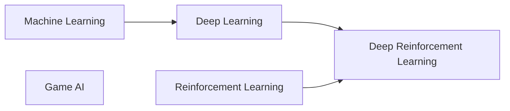

# AI Courses for High School Students

Project-first courses that teach AI through experiments students can run,
modify, and explain.

## New laptop setup

This section starts from a new Windows, macOS, or Linux laptop. You do not need
to install Python separately: Conda will create and manage the Python version
used by these courses.

### Laptop recommendations

A dedicated graphics card is not required for the introductory courses.
Deep-learning units that need a faster GPU can run in Google Colab.

- **Operating system:** a supported 64-bit version of Windows, macOS, or Linux
- **Memory:** 8 GB minimum; 16 GB recommended
- **Storage:** at least 30 GB free for software, datasets, and saved models
- **Processor:** a current Intel, AMD, or Apple Silicon processor
- **Internet:** required for initial installation and downloading datasets

A Chromebook needs Linux development support or a browser-based environment
such as Colab. The normal desktop setup below does not work in ChromeOS alone.

### What will be installed

| Tool | Why it is needed |
|---|---|
| Git | Downloads the repository and keeps course files up to date |
| Visual Studio Code | Edits Python and Markdown files and provides a terminal |
| Miniconda | Installs Conda, which creates an isolated Python environment |
| Python 3.11 | Runs the course code; Conda installs this inside the environment |
| Python packages | Provide data tools, plots, games, neural networks, and RL environments |
| Google Colab access | Provides an optional cloud GPU for later deep-learning units |

### 1. Install Git

Download Git from the [official Git download page](https://git-scm.com/downloads)
and choose the installer for the laptop's operating system.

- **Windows:** run the Git for Windows installer and accept the defaults.
- **macOS:** run `xcode-select --install` in Terminal, or use the macOS
  installer linked from the Git download page.
- **Ubuntu or Debian Linux:** run `sudo apt update`, followed by
  `sudo apt install git`.

Open a new terminal and check the installation:

```bash
git --version
```

The command should print a version number.

### 2. Install Visual Studio Code

Download and install [Visual Studio Code](https://code.visualstudio.com/download).
Then open its Extensions view and install the
[Python extension](https://marketplace.visualstudio.com/items?itemName=ms-python.python)
from Microsoft.

VS Code is recommended but not required. Another editor is fine if it can edit
Python files and open a terminal.

On macOS, the optional `code .` terminal command requires one extra step:

1. Open VS Code.
2. Press `Command+Shift+P`.
3. Search for and select `Shell Command: Install 'code' command in PATH`.

### 3. Install Conda with Miniconda

**Conda** is the environment and package-management command. **Miniconda** is
the small installer that puts Conda on the laptop. The full Anaconda
Distribution is not needed.

1. Open the
   [official Miniconda page](https://docs.conda.io/projects/conda/en/stable/user-guide/install/).
2. Select the installer that matches both the operating system and processor:
   - On a newer Mac with an M-series processor, choose **macOS Apple Silicon
     (arm64)**.
   - On an Intel Mac, choose **macOS Intel (x86_64)**.
   - On most Windows laptops, choose **Windows x86_64**.
   - On Linux, run `uname -m`; `x86_64` and `aarch64` need different
     installers.
3. Run the downloaded installer.
4. Install for the current user and accept the default location.
5. If asked whether to initialize Conda, choose **yes**.
6. Close and reopen the terminal after installation.

On Windows, use **Miniconda Prompt** from the Start menu for the first check.
On macOS or Linux, use Terminal.

Verify Conda:

```bash
conda --version
conda list
```

Both commands should complete without an error. If `conda` is not found on
macOS or Linux and Miniconda was installed in its default location, run:

```bash
source "$HOME/miniconda3/bin/activate"
conda init
```

Then close and reopen the terminal.

### 4. Download this repository

Choose a folder where course work should live, open a terminal there, and run:

```bash
git clone https://github.com/mattkiim/btree-classes.git
cd btree-classes
```

If the repository was downloaded as a ZIP file instead, unzip it and open a
terminal in the resulting folder. Git is still recommended for receiving
updates.

### 5. Create the course environment

Create one isolated environment named `btree-ai`:

```bash
conda create --name btree-ai python=3.11 pip --yes
conda activate btree-ai
python --version
```

The last command should report Python 3.11. Conda environments keep the course
packages separate from software used by the operating system.

Do not install course packages into Conda's `base` environment.

### 6. Install the Python packages

Keep `btree-ai` activated while running these commands.

First install the general data, plotting, notebook, and game packages:

```bash
python -m pip install --upgrade pip
python -m pip install numpy pandas matplotlib seaborn scikit-learn jupyterlab pygame
```

Install PyTorch and its image tools:

```bash
python -m pip install torch torchvision
```

The command above is suitable for ordinary CPU use and macOS. A Windows or
Linux laptop with a supported NVIDIA GPU should instead use the command
generated by PyTorch's
[official installation selector](https://pytorch.org/get-started/locally/).
Do not install CUDA separately unless that selector says it is needed.

Install the reinforcement-learning packages and the environments used later in
the course:

```bash
python -m pip install "gymnasium[classic-control,box2d]" "stable-baselines3[extra]"
```

The quotation marks are required because some terminals treat square brackets
specially.

These packages cover the planned courses:

- **NumPy, pandas, scikit-learn:** machine learning and data handling
- **Matplotlib, Seaborn:** plots and visual explanations
- **PyTorch, torchvision:** neural networks and deep learning
- **Gymnasium:** standard reinforcement-learning environments
- **Stable-Baselines3:** reference reinforcement-learning algorithms
- **Pygame:** Game AI projects and rendered Gymnasium environments
- **JupyterLab:** optional notebooks and interactive experiments
- **TensorBoard:** installed through the Stable-Baselines3 extras for training
  logs

Individual advanced units may name an additional package. Install it only when
that unit asks for it; the weekly material should explain why it is needed.

### 7. Verify the complete setup

Make sure the environment is active:

```bash
conda activate btree-ai
```

Check the main imports:

```bash
python -c "import numpy, pandas, matplotlib, seaborn, sklearn"
python -c "import torch, torchvision; print('PyTorch:', torch.__version__)"
python -c "import gymnasium, stable_baselines3, pygame"
```

No output from the first and third commands means the imports succeeded. The
second command should print the installed PyTorch version.

Run a project from the repository root:

```bash
python "ai classes/reinforcement learning/week01-bandits-v3/solutions/project_solution.py"
```

The program should print two button plans, the returned points, and the total
points.

### 8. Connect VS Code to the environment

1. Open the repository folder in VS Code.
2. Press `Command+Shift+P` on macOS or `Ctrl+Shift+P` on Windows/Linux.
3. Select `Python: Select Interpreter`.
4. Choose the interpreter whose name includes `btree-ai`.
5. Open a new VS Code terminal and run `python --version`.

If `btree-ai` is not listed, restart VS Code after creating the environment.

### Starting work later

Each new terminal starts outside the course environment. Before running course
code:

```bash
cd path/to/btree-classes
conda activate btree-ai
```

To open the interactive Week 1 lecture notebooks:

```bash
jupyter lab
```

JupyterLab will open in a browser. Navigate to a Week 1 bandit folder and open
`lecture.ipynb`.

When finished:

```bash
conda deactivate
```

To update an existing copy of the repository:

```bash
git pull
```

Run `git pull` only when personal changes have been saved or committed.

### Optional cloud GPU

Later deep-learning projects may run slowly on a laptop. A Google account gives
access to [Google Colab](https://colab.research.google.com/), where notebooks
can use a cloud GPU. No local GPU or CUDA installation is required for Colab.

The laptop setup is still useful for writing code, running small examples, and
working through the introductory courses.

### Common setup problems

- **`conda: command not found`:** reopen the terminal after installing
  Miniconda. If needed, follow the initialization command in Step 3.
- **The prompt does not show `(btree-ai)`:** run
  `conda activate btree-ai`.
- **`ModuleNotFoundError`:** activate `btree-ai`, then rerun the package
  installation command. Avoid using a different `pip`.
- **VS Code runs a different Python:** repeat `Python: Select Interpreter` and
  select `btree-ai`.
- **A path contains spaces:** wrap the complete path in quotation marks.
- **Box2D installation fails:** confirm that the environment uses Python 3.11,
  update pip, and retry the quoted Gymnasium installation command.
- **A plot does not appear:** run the file from a local desktop terminal rather
  than a headless remote session.

## Learning paths



- [Machine Learning](ai%20classes/machine%20learning/syllabus.md) covers data,
  evaluation, gradient descent, classical models, and neural-network basics.
- [Deep Learning](ai%20classes/deep%20learning/syllabus.md) builds on ML with
  PyTorch, CNNs, transformers, and generative models.
- [Reinforcement Learning](ai%20classes/reinforcement%20learning/syllabus.md) is
  a separate path covering agents, environments, value functions, and control.
- [Deep Reinforcement Learning](ai%20classes/deep%20reinforcement%20learning/syllabus.md)
  combines the Deep Learning and Reinforcement Learning paths.
- [Game AI](ai%20classes/game%20ai/syllabus.md) is a separate course covering
  navigation, behavior systems, adversarial search, and procedural generation.

## How to use a weekly unit

For implemented units such as `week01-bandits`, use the materials in this
order:

1. Follow `lecture.md` for concepts and guided code examples. The Week 1
   bandit variants also provide `lecture.ipynb` for running code interactively.
2. Read each `exercises/exerciseN.md` in numerical order.
3. Complete the corresponding `TODO` markers in `exercises/project.py`.
4. Run the project and interpret its output or plots.
5. Check your work against `solutions/` after attempting the exercises.
6. Try `stretch/exercise.md` for an optional challenge.

The lecture should be understandable on its own. `project.py` is the cumulative
student workspace for applying the lecture, not required advance reading.
