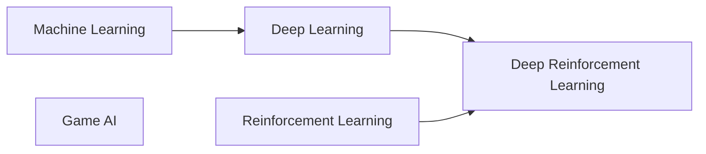

# AI Courses for High School Students

Project-first courses that teach AI through experiments students can run,
modify, and explain.

## Learning paths

- [Machine Learning](ai%20classes/machine%20learning/syllabus.md) covers data,
  evaluation, gradient descent, classical models, and neural-network basics.
- [Deep Learning](ai%20classes/deep%20learning/syllabus.md) builds on ML with
  PyTorch, CNNs, transformers, and generative models.
- [Reinforcement Learning](ai%20classes/reinforcement%20learning/syllabus.md) is
  a separate path covering agents, environments, value functions, and control.
- [Deep Reinforcement Learning](ai%20classes/deep%20reinforcement%20learning/syllabus.md)
  combines the Deep Learning and Reinforcement Learning paths.
- [Game AI](ai%20classes/game%20ai/syllabus.md) is a separate course covering
  navigation, behavior systems, adversarial search, and procedural generation.
