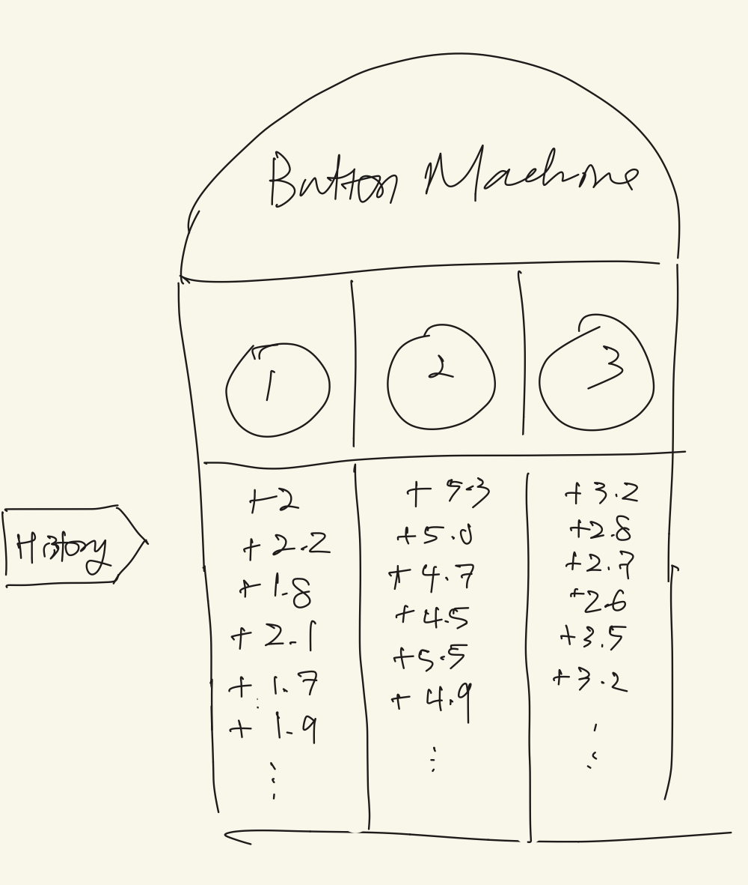
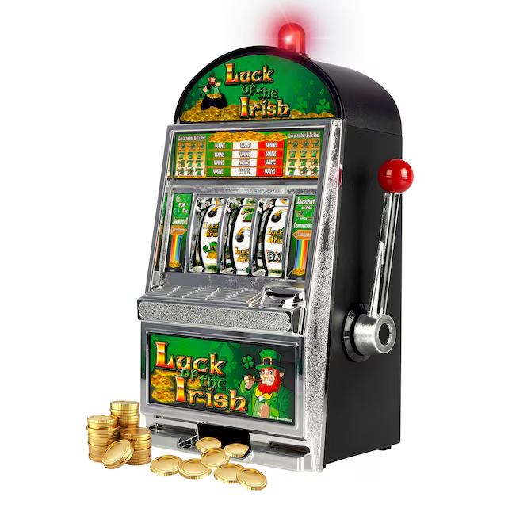

# Week 1 — Build a Mystery-Button Machine

## Goal

We will build a small Python program with several buttons that give random rewards (mystery-button machine). 

By the end of the week, you will be able to:

- point to the chooser, the choice, and the points in the example;
- explain why one button can return different points on different tries;
- implement the mystery-button machine as a Python class;
- try each button many times and describe what you observe.

We are essentially building a world that responds to choices.

## Example

Imagine a machine with three buttons:

```text
button 0 usually gives about 2 points
button 1 usually gives about 5 points
button 2 usually gives about 3 points
```



The goal is to accumulate the highest number of points. 

Before writing code, discuss:

1. Which button would you try first?
2. Would one try tell you enough?
3. What would you write down after each try?

There is no single correct plan yet. Today our program will only make the
buttons work.

## Preliminary Terms

### Environment

When you are making food, you are actively interacting with your kitchen and the tools in your kitchen. Similarly, in reinforcement learning, the **environment** is the part that receives a
choice and responds. Our mystery-button machine is the environment.

### Action

When making food, there are choices you have to make, such as which ingredients to select. In reinforcement learning, an **action** is a choice sent to the environment.
Here, the action is a button number such as `0`, `1`, or `2`.

### Reward

When you make food that tastes good, you might feel rewarded for your efforts. In reinforcement learning, a **reward** is simply a number returned by the
environment. It can be positive, zero, or negative. In our example, the reward
is the number of points returned by a button.

### Agent

An **agent** is the entity that chooses an action. For now, a person is the
agent. The mystery-button machine is not the agent; it only responds to the agent's actions. 

The whole interaction is:

```text
person chooses a button → machine returns points
agent chooses an action → environment returns a reward
```

### Inline exercise 1

A game character chooses `left`, and the game returns `-1` point.

Identify the agent, environment, action, and reward. Is the `-1` still called a
reward?

## Bandits

A machine known as multi-armed bandits is the initial example we will use to teach reinforcement learning due to its simplicity. 

A slot machine was once called a “one-armed bandit.” A machine with several
choices is therefore called a **multi-armed bandit**. The multi-armed bandit is the environment we will eventually teach an agent to interact with.



In our code:

- an **arm** means one button;
- **pulling an arm** means choosing that button;
- a `Bandit` object means the entire mystery-button machine.

Nothing in the program needs to look like a slot machine.

## Version 1: Deterministic Buttons

We will first build a version with no randomness. Each button always returns the
same points.

```python
# Define what every Bandit object should remember and do.
class Bandit:
    # This setup runs when we create a new Bandit.
    def __init__(self, button_rewards):
        # Remember how many points each button gives.
        self.button_rewards = button_rewards

        # Count how many buttons the machine has.
        self.number_of_arms = len(button_rewards)

    # This method runs when a person chooses one arm.
    def pull(self, arm):
        # "arm" is the number of the button the person chose.

        # Look up the points for that button.
        reward = self.button_rewards[arm]

        # Give those points back to the person.
        return reward
```

Now use it:

```python
# Create a machine whose three buttons give 2, 5, and 3 points.
bandit = Bandit([2.0, 5.0, 3.0])

# Pull button 0 once.
print(bandit.pull(0))

# Pull button 1 twice.
print(bandit.pull(1))
print(bandit.pull(1))
```

The output is predictable:

```text
2.0
5.0
5.0
```

### Inline exercise 2

Without running the code, predict the result of:

```python
# Create a machine with two buttons.
bandit = Bandit([10.0, -2.0])

# Ask how many buttons the machine has.
print(bandit.number_of_arms)

# Pull button 1 and print the points it returns.
print(bandit.pull(1))
```

Explain what each output means.

## Version 2: Non-Deterministic (Stochastic) Buttons

Real choices do not always have exactly the same result. We will let each
button's reward vary.

Python's `random` module can do this:

```python
# Import Python's random-number tool.
from random import Random

# Create a random-number generator.
# The seed 7 lets us repeat the same sequence later.
randomizer = Random(7)

# Ask for a number usually near 5.0, with a spread of about 1.0.
reward = randomizer.gauss(5.0, 1.0)

# Show the reward that was generated.
print(reward)
```

Read `randomizer.gauss(5.0, 1.0)` as:

> Give me a random number usually near 5.0, with a spread of about 1.0.

You do not need to know the mathematical formula behind `gauss`. The two
inputs have jobs we can understand:

- `5.0` is the **typical reward**;
- `1.0` is the **reward spread**—larger values create more variation.

Here is the matching change to `Bandit`:

```python
# Import the tool that will make the rewards vary.
from random import Random


# Define the new version of the Bandit.
class Bandit:
    # Set up one Bandit with its rewards, spread, and optional seed.
    def __init__(self, typical_rewards, reward_spread=1.0, seed=None):
        # Remember the typical reward for every arm.
        self.typical_rewards = typical_rewards

        # Count how many arms the machine has.
        self.number_of_arms = len(typical_rewards)

        # Remember how much the rewards should vary.
        self.reward_spread = reward_spread

        # Give this bandit its own repeatable random-number generator.
        self.randomizer = Random(seed)

    # Return one varying reward for the chosen arm.
    def pull(self, arm):
        # Look up the typical reward for the chosen arm.
        typical_reward = self.typical_rewards[arm]

        # Make one reward near that typical value.
        reward = self.randomizer.gauss(typical_reward, self.reward_spread)

        # Return the reward to whoever chose the arm.
        return reward
```

Setting `reward_spread=0.0` brings back the predictable version.

### Removing Randomness from Randomness

Random results make debugging difficult if they change every run. A **seed** is
a starting point for the random-number generator. The same seed produces the
same sequence, so you can repeat an experiment and compare the results.

The results still vary from pull to pull. The sequence is simply repeatable.

### Inline exercise 3

Predict which list will be more spread out:

```python
# This one has a small amount of variation.
quiet = Bandit([5.0], reward_spread=0.2, seed=1)

# This one has a larger amount of variation.
noisy = Bandit([5.0], reward_spread=3.0, seed=1)
```

Do both buttons still have the same typical reward?

## Redundant Data Collection

One result can be unusually high or low. Repeating a pull gives us more
evidence about what the button usually does.

```python
# Create a three-arm bandit.
bandit = Bandit([2.0, 5.0, 3.0], reward_spread=1.0, seed=7)

# Start an empty list where we can record what happens.
observed_rewards = []

# Repeat the indented code five times.
for _ in range(5):
    # Pull arm 1.
    reward = bandit.pull(1)

    # Add the new reward to our record.
    observed_rewards.append(reward)

# Show all five recorded rewards.
print(observed_rewards)
```

The list is our record of what happened. We can summarize it with an average:

```python
# Add the rewards together, then divide by the number of rewards.
average_reward = sum(observed_rewards) / len(observed_rewards)

# Show the average.
print(average_reward)
```

For example, the average of `[4, 5, 6]` is:

```text
(4 + 5 + 6) / 3 = 5
```

We do not need a new formula. The code uses the ordinary average you may
already know from everyday examples.

### Inline exercise 4

Two people test a button whose typical reward is 5.

- Person A sees `[8, 2]`.
- Person B sees `[4, 5, 6, 5, 4, 6]`.

Both lists have an average of 5. Which list gives you more confidence about
what the button usually returns? Why?

## The project

The starter project follows the same path as the lecture:

1. Make a predictable `Bandit`.
2. Check that each action returns the expected reward.
3. Add variation to the rewards.
4. Write `try_every_arm` to collect several rewards from each arm.
5. Print the observed rewards and their averages.

The project prints text instead of making a graph. We want to understand the
data before adding another way to display it.

## Topic backlog — useful, but not for this week

These ideas matter, but learning them now would hide this week's main idea.

- **Choosing buttons automatically:** Later, code will act as the agent.
- **Exploration and exploitation:** Later, the agent will decide when to try
  uncertain choices and when to use a choice that looks good.
- **Probability distributions:** Later, we can study the mathematics behind
  the random rewards. This week, reading `gauss` as “usually near” is enough.
- **Graphs and large experiments:** Later, plots will help compare many runs.
- **State:** Next week, the environment will remember where an agent is. The
  bandit has no location or changing situation.

## Wrap-up

Explain each answer in ordinary language first. Then use the course vocabulary.

- What choice goes into the bandit?
- What response comes out?
- Why can the same arm produce different rewards?
- What does the `Bandit` class represent?
- Why do we try a button several times?
- Which part of the example is still being played by a person?

## Common misunderstandings to watch for

- **“The typical reward is what I get every time.”** It is the center of many
  possible results, not a promise about one pull.
- **“A reward must be good.”** In reinforcement learning, “reward” is the
  technical name for the number returned, even when the number is negative.
- **“The bandit makes choices.”** The bandit responds to choices. It is the
  environment, not the agent.
- **“Random means every result is equally likely.”** Results near the typical
  reward occur more often in this example.
- **“The seed removes randomness.”** It makes a random sequence repeatable.
