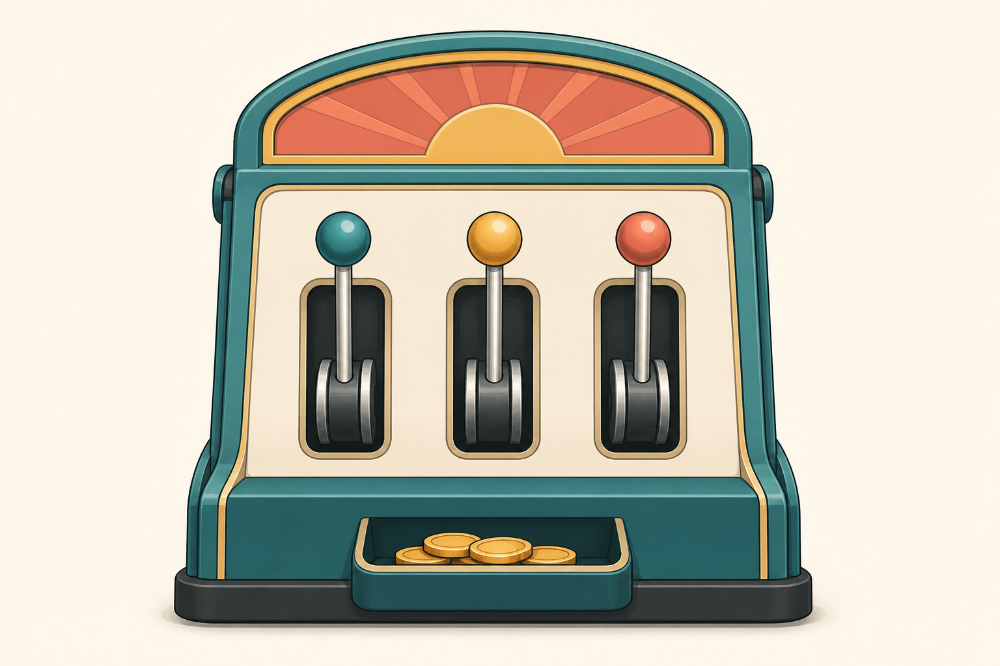
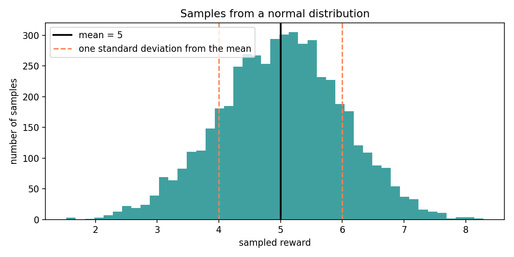

# Week 1 — Build a Multi-Armed Bandit

## Goal

This week, you will build a small Python environment with three choices. Each
choice returns points. By the end, the points will vary from one try to the
next, just as results vary in many real decisions.

By the end of the week, you will be able to:

- explain what a bandit is;
- connect **agent**, **environment**, **action**, and **reward** to code;
- implement a bandit with predictable rewards;
- improve it so rewards are random;
- explain how standard deviation changes the spread of rewards;
- collect enough results to avoid judging a button from one lucky or unlucky
  try.

You will build the project during the lecture. Each project exercise includes:

1. a summary of the idea;
2. a slightly updated code stub;
3. test code;
4. the expected output.

## What is a bandit?

A slot machine is sometimes called a **one-armed bandit**. The arm is the
handle a player pulls. The machine then returns a reward, which may be zero.

A **multi-armed bandit** is a simplified machine with several arms. Each arm is
one available choice.



Our Python version will use buttons instead of physical handles:

```text
arm 0 = button 0
arm 1 = button 1
arm 2 = button 2
```

The important idea is not the casino theme. It is the interaction:

```text
choose one option → receive one number
```

## Version 1: deterministic buttons

We will start with the simplest possible bandit. **Deterministic** means that
the same action always has the same result.

```python
# Define what the button machine remembers and does.
class Bandit:
    # Set up a machine from a list of button rewards.
    def __init__(self, button_rewards):
        # Store the reward for every button.
        self.button_rewards = list(button_rewards)

        # Count the buttons. The bandit word for a button is "arm."
        self.number_of_arms = len(self.button_rewards)

    # Press one button and return its reward.
    def pull(self, arm):
        # Use the arm number as a position in the reward list.
        reward = self.button_rewards[arm]

        # Send the reward back to the chooser.
        return reward
```

Use the class:

```python
# Create a machine with three predictable buttons.
bandit = Bandit([2.0, 5.0, 3.0])

# Press each button once.
print(bandit.pull(0))
print(bandit.pull(1))
print(bandit.pull(2))
```

The output is always:

```text
2.0
5.0
3.0
```

Button 1 is clearly best in this version because it always returns `5.0`.
There is no uncertainty yet.

## Project exercise 1 — build deterministic buttons

### What this exercise depicts

This checkpoint creates the smallest complete environment: an action goes in,
and a reward comes out. It deliberately leaves out randomness so you can first
verify that button numbers connect to the correct rewards.

Open `exercises/project.py`. Begin with this stub:

```python
class Bandit:
    def __init__(self, button_rewards):
        # TODO: Store a new list containing the button rewards.
        pass

        # TODO: Store the number of arms.

    def pull(self, arm):
        # TODO: Look up and return the chosen arm's reward.
        raise NotImplementedError


# Test code: leave this at the bottom of the file.
if __name__ == "__main__":
    test_bandit = Bandit([2.0, 5.0, 3.0])
    print("number of arms:", test_bandit.number_of_arms)
    print("arm 0:", test_bandit.pull(0))
    print("arm 1:", test_bandit.pull(1))
    print("arm 2:", test_bandit.pull(2))
```

After completing the TODOs, running the file should produce:

```text
number of arms: 3
arm 0: 2.0
arm 1: 5.0
arm 2: 3.0
```

Do not continue until your output matches.

### Inline exercise 1

In a familiar video game, a player presses the jump button, the character
jumps over an obstacle, and the game adds `100` points.

Identify the agent, environment, action, and reward.

## Words with specific meanings

These words also appear in everyday speech. The last column gives the precise
meaning we will use for the button machine.

| Word | Familiar example | Specific meaning in the button machine |
|---|---|---|
| **Agent** | A player making decisions in a game | The chooser that selects a button; for now, you are the agent |
| **Environment** | The surroundings that respond to what someone does | The entire `Bandit` object |
| **Action** | Something a person chooses to do | The button number passed to `pull` |
| **Reward** | A prize or something pleasant | The number returned by `pull`; it can be positive, zero, or negative |
| **Arm** | A body part or a slot-machine handle | One available button |
| **Pull** | Moving a physical handle | Calling `bandit.pull(arm)` |

The same interaction can now be described two ways:

```text
you press a button → the machine returns points
agent chooses an action → environment returns a reward
```

### Inline exercise 2

For `Bandit([4.0, -1.0, 2.0])`, predict the results of `pull(0)`, `pull(1)`,
and `pull(1)` again. Why is `-1.0` still called a reward?

## Example 1: what the random buttons will do

The completed machine will have these settings:

```text
button 0: rewards centered around 2 points
button 1: rewards centered around 5 points
button 2: rewards centered around 3 points
```

Three details matter:

1. **Each button has its own reward distribution.** A distribution is a rule
   describing which rewards are common and which are unusual.
2. **Every press takes a new sample.** A sample is the one reward produced on
   that press.
3. **The buttons act independently.** Pressing button 0 does not change the
   reward settings for buttons 1 or 2. Earlier rewards also do not change the
   next reward in this version.

The machine knows each button's reward distribution. The agent does not. The
agent only sees the samples returned after its choices.

## Improved version: rewards can vary

The deterministic bandit helped us check the connection between buttons and
rewards, but it was too easy. One press revealed exactly what a button would
always do.

We will now **improve the same bandit** so one button can return different
rewards on different presses.

Python can sample a bell-shaped distribution with `gauss`:

```python
# Import Python's random-number tool.
from random import Random

# Create a repeatable random-number generator.
randomizer = Random(7)

# Sample a reward centered around 5.0 with standard deviation 1.0.
reward = randomizer.gauss(5.0, 1.0)

# Show the sampled reward.
print(round(reward, 2))
```

The two inputs in `gauss(5.0, 1.0)` have different jobs:

- `5.0` is the **mean**, or center, of the rewards;
- `1.0` is the **standard deviation**, which controls their spread.

The mean is not a guaranteed reward. It is the point that many samples gather
around.

### What does a normal distribution look like?

`gauss` samples from a **Gaussian distribution**, which is another name for a
**normal distribution**. Its shape is often called a bell curve because
rewards near the mean appear frequently while rewards far from the mean appear
less frequently.

```python
# Import the plotting tool.
import matplotlib.pyplot as plt

# Use one mean and one standard deviation for this picture.
mean_reward = 5.0
standard_deviation = 1.0

# Create a repeatable collection of rewards.
normal_randomizer = Random(7)
normal_samples = [
    normal_randomizer.gauss(mean_reward, standard_deviation)
    for _ in range(5_000)
]

# Plot how often rewards appeared in each part of the number line.
plt.figure(figsize=(8, 4))
plt.hist(normal_samples, bins=45, color="teal", alpha=0.75)

# Mark the mean with a solid line.
plt.axvline(mean_reward, color="black", linewidth=2, label="mean = 5")

# Mark one standard deviation on either side with dashed lines.
plt.axvline(
    mean_reward - standard_deviation,
    color="coral",
    linestyle="--",
    label="one standard deviation from the mean",
)
plt.axvline(
    mean_reward + standard_deviation,
    color="coral",
    linestyle="--",
)

plt.title("Samples from a normal distribution")
plt.xlabel("sampled reward")
plt.ylabel("number of samples")
plt.legend()
plt.tight_layout()
plt.show()
```



Read the graph from the center outward:

- The tallest bars gather near the mean reward of `5.0`.
- The bars become shorter farther from the mean.
- The dashed lines mark `4.0` and `6.0`, one standard deviation below and
  above the mean.
- Samples outside the dashed lines are normal and expected; they are simply
  less common than samples near the center.

## See standard deviation in a graph

The following code samples the same mean with three standard deviations:

```python
# Import the plotting tool.
import matplotlib.pyplot as plt

# Compare three spreads around the same mean.
mean_reward = 5.0
standard_deviations = [0.5, 1.0, 2.0]

# Create one graph for each standard deviation.
figure, axes = plt.subplots(1, 3, figsize=(12, 3.5), sharey=True)

for axis, standard_deviation in zip(axes, standard_deviations):
    # Use a fresh generator so each graph is repeatable.
    graph_randomizer = Random(7)

    # Collect enough samples to reveal the overall shape.
    samples = [
        graph_randomizer.gauss(mean_reward, standard_deviation)
        for _ in range(2_000)
    ]

    # Draw bars showing where samples appeared.
    axis.hist(samples, bins=35, color="teal", alpha=0.75)

    # Mark the mean with a solid line.
    axis.axvline(mean_reward, color="black", linewidth=2, label="mean")

    # Mark one standard deviation on either side with dashed lines.
    axis.axvline(
        mean_reward - standard_deviation,
        color="coral",
        linestyle="--",
    )
    axis.axvline(
        mean_reward + standard_deviation,
        color="coral",
        linestyle="--",
    )

    axis.set_title(f"standard deviation = {standard_deviation}")
    axis.set_xlabel("sampled reward")

axes[0].set_ylabel("number of samples")
plt.tight_layout()
plt.show()
```

What to notice:

- A small standard deviation keeps rewards close to the mean.
- A large standard deviation spreads rewards across a wider range.
- The dashed lines are **not boundaries**. A reward can fall outside one
  standard deviation from the mean.
- For this bell-shaped distribution, about 68 out of 100 rewards fall within
  one standard deviation of the mean. About 95 out of 100 fall within two.
- Rewards even farther away are still possible, but their probability drops
  as the distance from the mean grows.

### Inline exercise 3

Two buttons both have mean reward `5.0`. One has standard deviation `0.2`; the
other has standard deviation `3.0`.

Which button is more predictable? Can the less predictable button still return
a value close to `5.0`?

## Project exercise 2 — improve the bandit

### What this exercise depicts

This checkpoint turns a fixed lookup table into a random environment. The arm
still selects the reward source, but each call now returns a fresh sample.

Replace the first checkpoint with this slightly modified stub. The completed
ideas from Exercise 1 remain visible; the new TODOs focus on randomness.

```python
from random import Random


class Bandit:
    def __init__(self, mean_rewards, reward_std=1.0, seed=None):
        # Keep the completed list and count behavior from Exercise 1.
        self.mean_rewards = list(mean_rewards)
        self.number_of_arms = len(self.mean_rewards)

        # TODO: Store reward_std.

        # TODO: Create self.randomizer using Random(seed).

    def pull(self, arm):
        # Keep the completed lookup behavior from Exercise 1.
        mean_reward = self.mean_rewards[arm]

        # TODO: Sample from gauss(mean_reward, self.reward_std).
        # TODO: Return the sampled reward.
        raise NotImplementedError


# Test code: use a zero standard deviation first.
if __name__ == "__main__":
    predictable = Bandit([2.0, 5.0, 3.0], reward_std=0.0, seed=7)
    print([predictable.pull(arm) for arm in range(3)])

    random_bandit = Bandit([2.0, 5.0, 3.0], reward_std=1.0, seed=7)
    print(round(random_bandit.pull(1), 2))
    print(round(random_bandit.pull(1), 2))
```

Expected output:

```text
[2.0, 5.0, 3.0]
4.74
5.51
```

The zero-spread test checks the button-to-mean connection. The final two lines
check that repeated pulls can vary.

### Why use a seed?

A seed makes a random sequence repeatable. It does not remove variation. It
lets you rerun the same test while debugging.

## Repeated data collection

One result can be lucky or unlucky. Repeating a pull gives us more evidence
about what a button usually returns.

```python
# Create the improved three-arm bandit.
bandit = Bandit([2.0, 5.0, 3.0], reward_std=1.0, seed=7)

# Start an empty record.
observed_rewards = []

# Pull arm 1 five times.
for _ in range(5):
    reward = bandit.pull(1)
    observed_rewards.append(reward)

# Show the individual samples and their average.
print([round(reward, 2) for reward in observed_rewards])
print(round(sum(observed_rewards) / len(observed_rewards), 2))
```

> **Data lesson:** Never train or evaluate a system from only one or two random
> results. A very small sample can make a weak choice look excellent or a good
> choice look terrible. Collect repeated samples, keep the conditions the
> same, and describe how much the results vary—not only their average.

### Inline exercise 4

Two people test a button whose mean reward is `5`:

- Person A records `[8, 2]`.
- Person B records `[4, 5, 6, 5, 4, 6]`.

Both records have an average of `5`. Which record gives stronger evidence
about the button? What can neither record prove?

## Project exercise 3 — sample every arm

### What this exercise depicts

This checkpoint separates **collecting data** from **judging the data**. The
function returns every observation instead of hiding them behind one average.

Keep your completed `Bandit`, then add this function and test:

```python
def sample_every_arm(bandit, samples_per_arm):
    # Start an empty outer list.
    all_samples = []

    # Visit every arm.
    for arm in range(bandit.number_of_arms):
        # Start a list for this arm.
        samples_for_this_arm = []

        # Pull this arm the requested number of times.
        for _ in range(samples_per_arm):
            # TODO: Pull the arm and append its reward.
            pass

        # TODO: Append this arm's completed list to all_samples.

    # Return the list of lists.
    return all_samples


# Test code: zero spread makes the expected structure easy to inspect.
if __name__ == "__main__":
    test_bandit = Bandit([2.0, 5.0, 3.0], reward_std=0.0, seed=7)
    test_samples = sample_every_arm(test_bandit, samples_per_arm=3)
    print(test_samples)
```

Expected output:

```text
[[2.0, 2.0, 2.0], [5.0, 5.0, 5.0], [3.0, 3.0, 3.0]]
```

After that test passes, change `reward_std` to `1.0` and
`samples_per_arm` to `100`. Print the average for each arm. The averages should
usually be near `2`, `5`, and `3`, but they need not match exactly.

## Completed project

Your final `exercises/project.py` should now:

1. define the improved `Bandit`;
2. sample a reward when an arm is pulled;
3. collect repeated samples from every arm;
4. print individual results and averages;
5. display the standard-deviation comparison graph.

The starter file contains the cumulative TODOs. The lecture checkpoints let
you replace one small working version with the next rather than attempting the
whole project at once.

## Optional stretch — let a person choose

The stretch exercise adds `play_by_hand(bandit, number_of_turns)`. A person
enters the next arm after seeing earlier rewards. This previews how choices can
depend on experience without requiring an automatic learning rule.

The stretch file includes sample inputs and exact sample outputs using
`reward_std=0.0`. Start with that predictable test before trying random
rewards.

## Topic backlog — useful, but not this week

- **Automatic action selection:** Later, code will become the agent.
- **Exploration and exploitation:** Later, the agent will decide when to try
  uncertain arms and when to repeat a promising arm.
- **Comparing strategies:** A fair comparison needs many runs and controlled
  conditions, not one score.
- **Probability formulas:** This week, graphs and samples are enough to
  understand mean and standard deviation.
- **State:** Next week, an action will change the agent's situation. A bandit
  presents the same choices after every pull.

## Wrap-up

- Why did we build deterministic buttons before random buttons?
- What remains unchanged when one arm is pulled?
- What is the difference between a distribution and one sample?
- What does standard deviation change?
- Why are the standard-deviation lines not hard boundaries?
- Why should one reward not decide whether a button is good?
- Which part of this week's interaction is still performed by a person?

## Next week

This week, every pull returned a reward without changing the available
situation. Next week, we will build Gridworld. An action will change the
agent's location, introducing the specific reinforcement-learning meaning of
**state**.

## Common misunderstandings to watch for

- **“The mean is the reward.”** The mean is the center of a distribution; one
  sample can be above or below it.
- **“All rewards must stay within one standard deviation.”** Values outside
  that range are expected. Farther values are possible but less likely.
- **“Pulling one arm changes another arm.”** The arms in this environment are
  independent; one pull does not change their settings.
- **“A reward must be positive.”** Reward is the specific name for the number
  returned by the environment, including zero or negative values.
- **“The bandit chooses the action.”** The bandit responds to an action. A
  person is the agent this week.
- **“One high reward proves an arm is best.”** Small samples are easily
  distorted by luck.
- **“A seed makes rewards constant.”** A seed repeats a varying sequence.
