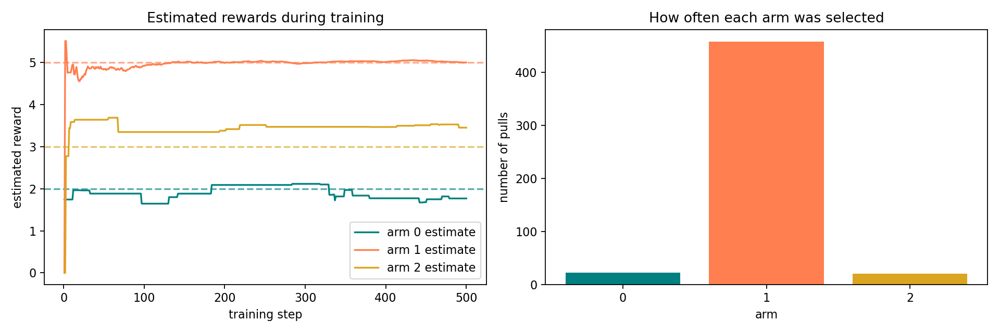

# Week 2 — Train an Agent on the Bandit

## Goal

Last week, you built an environment: a multi-armed bandit that receives an arm
number and returns a reward. A person still had to choose every arm.

This week, you will build the chooser.

By the end of the week, you will be able to:

- keep the bandit environment separate from the agent;
- record how often the agent has chosen each arm;
- estimate an arm's reward from the samples seen so far;
- explain trying an uncertain arm and using a promising arm;
- train an agent through repeated action–reward interactions;
- read a graph showing how the agent's estimates change during training.

You will build the project during the lecture. Each project exercise includes:

1. a summary of the idea;
2. a slightly updated code stub;
3. test code;
4. the expected output.

## Start with a decision

Suppose you have pressed each button several times and written down this table:

| Button | Rewards observed | Current average |
|---|---|---:|
| 0 | `1.5, 2.5` | `2.0` |
| 1 | `4.0, 6.0` | `5.0` |
| 2 | `3.0` | `3.0` |

You have ten presses left.

- Which button would you press next if your only goal were immediate points?
- Why might you still try button 0 or button 2?
- What information must a program remember to make the same decision?

The agent will need two abilities:

1. **learn from a reward** by updating its records;
2. **choose an action** using those records.

## Reuse the Week 1 environment

The bandit remains the environment. We do not need to change it to train an
agent.

```python
# Import Python's random-number tool.
from random import Random


# This is the environment built in Week 1.
class Bandit:
    def __init__(self, mean_rewards, reward_std=1.0, seed=None):
        # Store the hidden center of each arm's reward distribution.
        self.mean_rewards = list(mean_rewards)
        self.number_of_arms = len(self.mean_rewards)

        # Store the shared reward spread and a repeatable random generator.
        self.reward_std = reward_std
        self.randomizer = Random(seed)

    def pull(self, arm):
        # Select the chosen arm's reward distribution.
        mean_reward = self.mean_rewards[arm]

        # Return one fresh sample from that distribution.
        reward = self.randomizer.gauss(mean_reward, self.reward_std)
        return reward
```

The environment knows `mean_rewards`. The agent must not read that list. If it
could, it would already know the answer and would not need training.

## Agent and environment have different jobs

```text
agent chooses an arm
        ↓
bandit returns a reward
        ↓
agent updates its records
        ↓
repeat
```

| Part | Information it owns | Job |
|---|---|---|
| `Bandit` environment | Hidden reward settings | Turn an arm number into one sampled reward |
| `BanditAgent` | Actions and rewards seen so far | Choose an arm and learn from the returned reward |
| Training loop | Number of training steps | Pass actions and rewards between the two objects |

### Inline exercise 1

Why would this be a poor agent method?

```python
def choose_action(self, bandit):
    # This reads information that should be hidden from the agent.
    return bandit.mean_rewards.index(max(bandit.mean_rewards))
```

## First ability: remember what happened

The agent begins with no experience:

```text
arm:                 0    1    2
number of pulls:     0    0    0
total reward:      0.0  0.0  0.0
estimated reward:  0.0  0.0  0.0
```

An **estimate** is the agent's current guess based on the samples it has seen.
It is not the hidden mean stored by the environment.

After selecting arm 1 and receiving rewards `4.0` and `6.0`, its records become:

```text
arm:                 0    1    2
number of pulls:     0    2    0
total reward:      0.0 10.0  0.0
estimated reward:  0.0  5.0  0.0
```

The estimate is the ordinary average:

```text
total reward ÷ number of pulls = 10 ÷ 2 = 5
```

Here is the matching code:

```python
class BanditAgent:
    def __init__(self, number_of_arms):
        # Start one count, total, and estimate for every arm.
        self.counts = [0] * number_of_arms
        self.total_rewards = [0.0] * number_of_arms
        self.estimates = [0.0] * number_of_arms

    def learn(self, arm, reward):
        # Record one more pull of this arm.
        self.counts[arm] += 1

        # Add the new reward to this arm's total.
        self.total_rewards[arm] += reward

        # Recalculate the average reward observed for this arm.
        self.estimates[arm] = (
            self.total_rewards[arm] / self.counts[arm]
        )
```

### Inline exercise 2

An arm has been pulled twice. Its rewards were `2.0` and `8.0`. The next reward
is `5.0`. What will its count, total reward, and estimate become?

## Project exercise 1 — give the agent a memory

### What this exercise depicts

This checkpoint gives the agent a memory without asking it to make decisions
yet. You will supply an arm and reward by hand, then inspect exactly what
changed.

Begin with this stub:

```python
class BanditAgent:
    def __init__(self, number_of_arms):
        # TODO: Create one zero count for every arm.
        pass

        # TODO: Create one zero total reward for every arm.

        # TODO: Create one zero estimate for every arm.

    def learn(self, arm, reward):
        # TODO: Increase the selected arm's count.

        # TODO: Add reward to the selected arm's total.

        # TODO: Recalculate only the selected arm's estimate.
        pass


# Test code: give arm 1 two rewards by hand.
if __name__ == "__main__":
    test_agent = BanditAgent(number_of_arms=3)
    test_agent.learn(arm=1, reward=4.0)
    test_agent.learn(arm=1, reward=6.0)

    print("counts:   ", test_agent.counts)
    print("totals:   ", test_agent.total_rewards)
    print("estimates:", test_agent.estimates)
```

Expected output:

```text
counts:    [0, 2, 0]
totals:    [0.0, 10.0, 0.0]
estimates: [0.0, 5.0, 0.0]
```

Check that arms 0 and 2 remain unchanged.

## Second ability: choose an action

At the beginning, every estimate is zero. That does not mean every arm is
worth zero; it means the agent has no evidence yet.

Our first decision rule will be:

1. Try every untested arm once, in order.
2. After every arm has been tested, choose the largest estimate.

The first step prevents an untested arm from being mistaken for a bad arm.

```python
def choose_action(self):
    # First return the earliest arm with no samples.
    for arm, count in enumerate(self.counts):
        if count == 0:
            return arm

    # Find the largest current estimate.
    best_estimate = max(self.estimates)

    # Collect every arm tied at that estimate.
    best_arms = [
        arm
        for arm, estimate in enumerate(self.estimates)
        if estimate == best_estimate
    ]

    # Return the only best arm, or randomly break a tie.
    if len(best_arms) == 1:
        return best_arms[0]
    return self.randomizer.choice(best_arms)
```

Choosing the largest current estimate is called a **greedy** choice. Here,
“greedy” is a specific technical word. It means choosing what looks best now;
it is not a judgment about someone's personality.

### Inline exercise 3

An agent has counts `[3, 0, 2]` and estimates `[2.5, 0.0, 4.0]`.

Which arm will `choose_action` return? Why does it not return the arm with the
largest estimate?

## Project exercise 2 — choose using estimates

### What this exercise depicts

This checkpoint turns the record keeper into a basic decision-maker. It first
gathers one sample from every arm, then uses the evidence it has collected.

Replace Exercise 1 with this slightly modified stub:

```python
from random import Random


class BanditAgent:
    def __init__(self, number_of_arms, seed=None):
        # Keep the completed memory from Exercise 1.
        self.counts = [0] * number_of_arms
        self.total_rewards = [0.0] * number_of_arms
        self.estimates = [0.0] * number_of_arms

        # A random generator will break ties repeatably.
        self.randomizer = Random(seed)

    def learn(self, arm, reward):
        # Keep the completed update from Exercise 1.
        self.counts[arm] += 1
        self.total_rewards[arm] += reward
        self.estimates[arm] = (
            self.total_rewards[arm] / self.counts[arm]
        )

    def choose_action(self):
        # TODO: Return the first arm whose count is zero.

        # TODO: Find the largest estimate.

        # TODO: Build a list of arms tied at the largest estimate.

        # TODO: Return the best arm, randomly breaking a tie if needed.
        raise NotImplementedError


# Test code: reveal one reward for each arm.
if __name__ == "__main__":
    test_agent = BanditAgent(number_of_arms=3, seed=7)

    print("first choice: ", test_agent.choose_action())
    test_agent.learn(0, 2.0)

    print("second choice:", test_agent.choose_action())
    test_agent.learn(1, 5.0)

    print("third choice: ", test_agent.choose_action())
    test_agent.learn(2, 3.0)

    print("best choice:  ", test_agent.choose_action())
```

Expected output:

```text
first choice:  0
second choice: 1
third choice:  2
best choice:   1
```

## Why always choosing the best estimate can fail

Suppose the first sample from the truly best arm is unusually low:

```text
hidden mean reward:       arm 0 = 2, arm 1 = 5, arm 2 = 3
first sampled rewards:    arm 0 = 2, arm 1 = 1, arm 2 = 3
```

After those samples, arm 2 looks best even though arm 1 has the highest hidden
mean. A purely greedy agent may keep choosing arm 2 and never gather evidence
that corrects its unlucky first impression.

We will improve the decision rule:

- usually choose the arm with the largest estimate;
- occasionally choose a random arm.

Trying an arm to gather information is **exploration**. Using the arm that
currently looks best is **exploitation**.

| Word | Familiar meaning | Specific meaning in this bandit |
|---|---|---|
| **Training** | Practicing to improve | Repeating action, reward, and update steps |
| **Estimate** | An informed guess | The average reward observed for one arm |
| **Exploration** | Looking somewhere unfamiliar | Choosing an arm to gather more information |
| **Exploitation** | Often means taking unfair advantage | Using the arm with the largest current estimate |
| **Policy** | Often means an official rule | The agent's rule for choosing an action |

In this course, exploitation does not mean mistreating someone. It means using
information the agent has already gathered.

## Improved decision rule: occasional exploration

We will store an `exploration_rate` between `0.0` and `1.0`:

```text
exploration_rate = 0.0  → never make an extra random choice
exploration_rate = 0.1  → explore on about 1 out of 10 choices
exploration_rate = 1.0  → choose randomly every time after initial testing
```

The code checks for exploration after every arm has been tried once:

```python
def choose_action(self):
    # Give every untested arm its first sample.
    for arm, count in enumerate(self.counts):
        if count == 0:
            return arm

    # Occasionally explore by choosing any arm at random.
    should_explore = self.randomizer.random() < self.exploration_rate
    if should_explore:
        return self.randomizer.randrange(len(self.counts))

    # Otherwise exploit the largest current estimate.
    best_estimate = max(self.estimates)
    best_arms = [
        arm
        for arm, estimate in enumerate(self.estimates)
        if estimate == best_estimate
    ]

    if len(best_arms) == 1:
        return best_arms[0]
    return self.randomizer.choice(best_arms)
```

This choice rule is commonly called **epsilon-greedy**. The Greek letter
epsilon is often used for the exploration rate. Knowing the name is useful;
using the rule correctly matters more this week.

### Inline exercise 4

Label each choice as exploration or exploitation:

1. The agent chooses arm 2 because it has the largest estimate.
2. The agent randomly chooses arm 0 even though arm 2 has the largest estimate.
3. The agent chooses an arm it has never tried.

## Connect the agent and environment

Training is a repeated conversation between two objects:

```python
def train(bandit, agent, number_of_steps):
    # Keep records that will help us inspect training later.
    actions = []
    rewards = []
    estimate_history = []

    for _ in range(number_of_steps):
        # The agent chooses using only its own records.
        arm = agent.choose_action()

        # The environment responds to that action.
        reward = bandit.pull(arm)

        # The agent learns from the response.
        agent.learn(arm, reward)

        # Save what happened during this step.
        actions.append(arm)
        rewards.append(reward)
        estimate_history.append(agent.estimates.copy())

    return actions, rewards, estimate_history
```

The order matters:

```text
choose → pull → learn → record → repeat
```

Training does not reveal the hidden means. It gives the agent more experience
from which to build estimates.

## Project exercise 3 — train the complete agent

### What this exercise depicts

This checkpoint completes the reinforcement-learning loop. The environment
produces experience, while the agent changes its estimates and future choices
because of that experience.

Use this cumulative stub. It keeps the completed memory and adds the final
decision rule and training loop:

```python
from random import Random


class BanditAgent:
    def __init__(
        self,
        number_of_arms,
        exploration_rate=0.1,
        seed=None,
    ):
        # Keep the completed memory from Exercise 1.
        self.counts = [0] * number_of_arms
        self.total_rewards = [0.0] * number_of_arms
        self.estimates = [0.0] * number_of_arms

        # Store the new exploration setting.
        self.exploration_rate = exploration_rate
        self.randomizer = Random(seed)

    def learn(self, arm, reward):
        # Keep the completed update from Exercise 1.
        self.counts[arm] += 1
        self.total_rewards[arm] += reward
        self.estimates[arm] = (
            self.total_rewards[arm] / self.counts[arm]
        )

    def choose_action(self):
        # TODO: Try every untested arm once.

        # TODO: Explore with probability exploration_rate.

        # TODO: Otherwise return an arm with the largest estimate.
        raise NotImplementedError


def train(bandit, agent, number_of_steps):
    # TODO: Create lists for actions, rewards, and estimate history.

    # TODO: Repeat choose, pull, learn, and record.

    # TODO: Return all three records.
    raise NotImplementedError


# Test code: remove reward noise so the expected output is exact.
if __name__ == "__main__":
    test_bandit = Bandit(
        [2.0, 5.0, 3.0],
        reward_std=0.0,
        seed=7,
    )
    test_agent = BanditAgent(
        number_of_arms=3,
        exploration_rate=0.1,
        seed=7,
    )

    actions, rewards, history = train(
        test_bandit,
        test_agent,
        number_of_steps=20,
    )

    print("actions:  ", actions)
    print("counts:   ", test_agent.counts)
    print("estimates:", test_agent.estimates)
```

Expected output:

```text
actions:   [0, 1, 2, 1, 1, 1, 2, 2, 2, 1, 1, 0, 1, 2, 1, 1, 1, 1, 1, 1]
counts:    [2, 13, 5]
estimates: [2.0, 5.0, 3.0]
```

The exact action list depends on the code order and seed. The important
behavior is that every arm is tried, estimates match the noise-free rewards,
and the best-looking arm is selected most often.

## Watch the agent learn

Now restore `reward_std=1.0` and train for `500` steps. The graph below shows
two views of the same run:



Read the graph from left to right:

- At first, each estimate moves sharply because it is based on very few
  samples.
- As an arm receives more samples, its estimate usually becomes steadier.
- Arm 1's estimate approaches the hidden mean of `5.0`.
- The agent selects arm 1 much more often because it has the largest estimate.
- Arms 0 and 2 still receive some samples because the agent explores.

The dashed horizontal lines show the environment's hidden means for evaluation.
The agent does not use those lines while choosing.

### Inline exercise 5

Arm 0's estimate is less smooth than arm 1's estimate. Use the arm-count graph
to explain why.

> **Training lesson:** A changing estimate is not automatically a bug. Early
> estimates are built from small samples and can move substantially. Inspect
> the counts, individual rewards, and longer-term direction before judging the
> result.

## Completed project

Your final training program should:

1. create the Week 1 `Bandit` environment;
2. create a `BanditAgent` with counts, totals, and estimates;
3. try every arm at least once;
4. alternate between exploration and exploitation;
5. connect both objects with a training loop;
6. print final counts and estimates;
7. plot estimate history and final arm counts.

The reference implementation is in `solutions/project_solution.py`.

## Optional stretch — change the exploration rate

Keep the bandit, seeds, and number of training steps fixed. Run the agent with:

```text
exploration_rate = 0.0
exploration_rate = 0.1
exploration_rate = 0.5
```

For each setting, record:

- final arm counts;
- final estimates;
- total reward;
- one observation about the training graph.

This is a first investigation, not a final claim about which setting is best.
A fair strategy comparison across many random runs belongs in a later lesson.

## Topic backlog — useful, but not this week

- **Incremental-average formula:** We used totals and counts because they map
  directly to the familiar average. Later, the same estimate can be updated
  without storing a total.
- **Comparing agents fairly:** One seed is useful for debugging but not enough
  evidence for a general conclusion.
- **Changing exploration:** Later, the exploration rate can shrink during
  training.
- **Regret:** Later, we can measure reward lost while the agent is learning.
- **State:** This bandit always presents the same arms. The next environment
  will have a situation that changes after an action.

## Wrap-up

- What information belongs to the environment but stays hidden from the agent?
- What does an estimate represent?
- Why must every arm receive an initial sample?
- How can a greedy choice preserve an unlucky first impression?
- What is the specific meaning of exploration in this lesson?
- What is the specific meaning of exploitation?
- Which line in `train` allows experience to change future actions?
- Why should estimates become steadier after more samples?

## Next week

The bandit always presents the same three choices. Next week, we will build a
Gridworld where an action changes the agent's location. That changing situation
will introduce the reinforcement-learning meaning of **state**.

## Common misunderstandings to watch for

- **“The estimate is the hidden mean.”** The estimate is the agent's guess
  based only on observed rewards.
- **“Training means giving the agent the correct answer.”** Training supplies
  interactions; the agent must update from their rewards.
- **“A zero estimate means an arm is worthless.”** Before an arm is tried,
  zero means no evidence.
- **“Greedy means selfish.”** Here, greedy means choosing the largest current
  estimate.
- **“Exploration always chooses a bad arm.”** A random exploratory choice can
  still select the best arm.
- **“Exploitation is unethical.”** Here, it means using current knowledge.
- **“The best arm must return the highest reward every time.”** It has the
  highest mean, but individual rewards vary.
- **“One successful run proves the exploration rate is best.”** Random results
  require repeated controlled comparisons.
