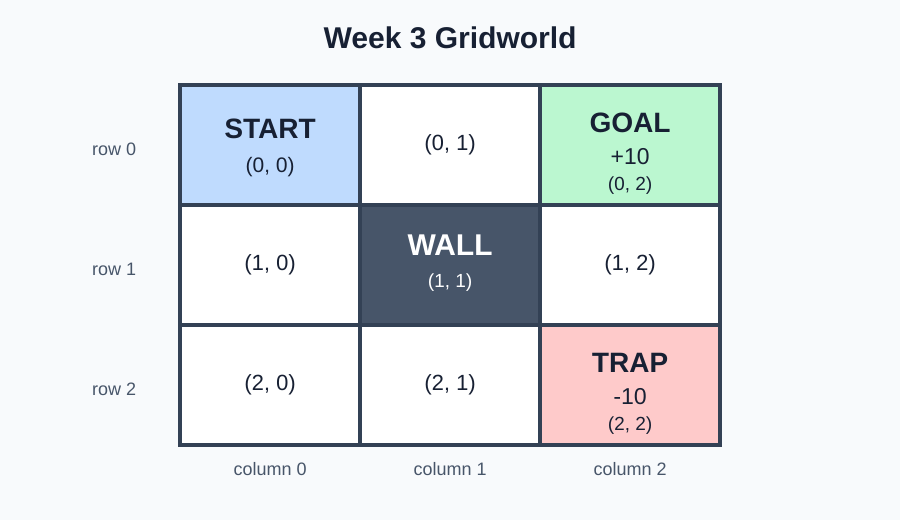

# Week 3 — Build a Gridworld Environment

## Goal

In Week 1, you built a bandit environment. In Week 2, you built an agent that
learned which button to press. The bandit always presented the same buttons,
no matter what happened before.

This week, the available situation can change after every action.

You will build a small Gridworld environment. A person will still provide the
actions. Keeping the chooser simple lets us focus on how the environment works.

By the end of the week, you will be able to:

- represent a location with a Python tuple;
- explain the specific meanings of state, action, and transition;
- move through a grid without crossing walls or boundaries;
- return a new state, reward, and ending signal after an action;
- reset the environment for a new run;
- record and read one complete path through the grid.

You will build the project during the lecture. Each project exercise includes:

1. a summary of the idea;
2. a slightly updated code stub;
3. test code;
4. the expected output.

## Start with a route

Imagine a game board with nine squares:

```text
S  .  +
.  #  .
.  .  -
```

- `S` is the starting square.
- `.` is an open square.
- `#` is a wall that cannot be entered.
- `+` is a goal worth `10` points.
- `-` is a trap worth `-10` points.

Every ordinary move costs `1` point, so its reward is `-1`.

Before writing code, find:

- the shortest route from `S` to `+`;
- a route from `S` to `-`;
- an action that tries to walk into the wall;
- an action that tries to leave the board.



## What changed after the bandit?

The bandit returned a reward, then presented the same buttons again.

Gridworld returns a reward **and** changes the current location:

```text
current location + action → next location + reward
```

For example:

```text
(0, 0) + "right" → (0, 1) + reward -1
```

The next action begins from `(0, 1)`, not from `(0, 0)`. Earlier actions can
therefore change what happens later.

## First idea: represent a location

We will number rows and columns from zero, just like Python list positions:

```text
              column
             0       1       2
row 0      (0, 0)  (0, 1)  (0, 2)
row 1      (1, 0)  (1, 1)  (1, 2)
row 2      (2, 0)  (2, 1)  (2, 2)
```

A location is a tuple containing `(row, column)`:

```python
# Store the top-left location.
location = (0, 0)

# Read its two parts.
row, column = location

# Display the parts in the same order as the tuple.
print("row:", row)
print("column:", column)
```

Expected output:

```text
row: 0
column: 0
```

In everyday conversation, a **state** can mean a condition, such as “the door
is open.” In this Gridworld, **state** is the technical name for the
environment's current location.

```python
class Gridworld:
    def __init__(self):
        # Remember the board size.
        self.rows = 3
        self.columns = 3

        # Remember where every new run begins.
        self.start_state = (0, 0)

        # Begin at the starting state.
        self.state = self.start_state

    def reset(self):
        # Return the environment to its starting state.
        self.state = self.start_state
        return self.state
```

`reset()` starts a new run. Returning the starting state lets the caller know
where that run begins.

### Inline exercise 1

Which tuple represents the square in the bottom row and middle column? Which
part of the tuple tells you the row?

## Project exercise 1 — remember and reset the state

### What this exercise depicts

This checkpoint gives the environment one changing piece of information: its
current location. You will change that location by hand, then confirm that
`reset()` restores the start.

Begin with this stub:

```python
class Gridworld:
    def __init__(self):
        # Store a board with three rows and three columns.
        self.rows = 3
        self.columns = 3

        # TODO: Store (0, 0) as the starting state.

        # TODO: Set the current state to the starting state.

    def reset(self):
        # TODO: Restore and return the starting state.
        pass


# Test code: move the state by hand, then reset it.
if __name__ == "__main__":
    test_world = Gridworld()

    print("starting state:", test_world.state)

    test_world.state = (2, 0)
    print("changed state: ", test_world.state)

    returned_state = test_world.reset()
    print("reset returned:", returned_state)
    print("current state: ", test_world.state)
```

Expected output:

```text
starting state: (0, 0)
changed state:  (2, 0)
reset returned: (0, 0)
current state:  (0, 0)
```

Both final lines should show `(0, 0)`. The method must change the stored state,
not merely return the starting tuple.

## Second idea: turn an action into movement

In everyday conversation, an **action** is something someone does. In this
Gridworld, an action is one of four exact strings:

```text
"up"    "down"    "left"    "right"
```

Each action changes the row or column by one:

| Action | Row change | Column change |
|---|---:|---:|
| `"up"` | `-1` | `0` |
| `"down"` | `+1` | `0` |
| `"left"` | `0` | `-1` |
| `"right"` | `0` | `+1` |

We can store those changes in a dictionary:

```python
# Match each action name to a row and column change.
action_changes = {
    "up": (-1, 0),
    "down": (1, 0),
    "left": (0, -1),
    "right": (0, 1),
}

# Begin in the top-left square.
row, column = (0, 0)

# Look up what "right" changes.
row_change, column_change = action_changes["right"]

# Combine the current location and the change.
candidate_state = (
    row + row_change,
    column + column_change,
)

print(candidate_state)
```

Expected output:

```text
(0, 1)
```

We call it a **candidate state** because the environment must check it before
moving there.

## Check boundaries and walls

Two kinds of candidate state are blocked:

1. a location outside the board;
2. a wall location.

If an action is blocked, the state stays unchanged.

```text
starting state       action       candidate       result
(0, 0)               "up"         (-1, 0)         (0, 0)
(0, 1)               "down"       (1, 1) wall     (0, 1)
(0, 0)               "right"      (0, 1) open     (0, 1)
```

The matching checks are:

```python
def is_inside(self, state):
    # Separate the row and column so each boundary is visible.
    row, column = state

    # Return True only when both numbers are inside the board.
    return (
        0 <= row < self.rows
        and 0 <= column < self.columns
    )

def move(self, action):
    # Reject an action name the environment does not understand.
    if action not in self.action_changes:
        raise ValueError(f"Unknown action: {action}")

    # Look up how this action changes the row and column.
    row_change, column_change = self.action_changes[action]
    row, column = self.state

    # Build the location the action tries to enter.
    candidate_state = (
        row + row_change,
        column + column_change,
    )

    # Move only when the candidate is inside and is not a wall.
    if (
        self.is_inside(candidate_state)
        and candidate_state not in self.wall_states
    ):
        self.state = candidate_state

    # Return the resulting state, even if the action was blocked.
    return self.state
```

### Inline exercise 2

The current state is `(0, 1)`. Predict the resulting state after each action:

1. `"down"`
2. `"left"`
3. `"up"`

Treat each item as a separate test that starts from `(0, 1)`.

## Project exercise 2 — move without crossing barriers

### What this exercise depicts

This checkpoint lets an action change the state. The environment checks the
requested location instead of blindly accepting every move.

Replace Exercise 1 with this slightly modified stub:

```python
class Gridworld:
    def __init__(self):
        # Keep the board and state from Exercise 1.
        self.rows = 3
        self.columns = 3
        self.start_state = (0, 0)
        self.state = self.start_state

        # Add the blocked center square.
        self.wall_states = {(1, 1)}

        # Match each allowed action to its location change.
        self.action_changes = {
            "up": (-1, 0),
            "down": (1, 0),
            "left": (0, -1),
            "right": (0, 1),
        }

    def reset(self):
        # Keep the completed reset from Exercise 1.
        self.state = self.start_state
        return self.state

    def is_inside(self, state):
        # TODO: Return whether both coordinates are inside the board.
        pass

    def move(self, action):
        # TODO: Reject an action not found in action_changes.

        # TODO: Calculate the candidate state.

        # TODO: Move only if the candidate is inside and is not a wall.

        # TODO: Return the resulting state.
        pass


# Test code: try an open square, a wall, and a boundary.
if __name__ == "__main__":
    test_world = Gridworld()

    print("start:         ", test_world.state)
    print("move right:    ", test_world.move("right"))
    print("wall blocks:   ", test_world.move("down"))
    print("move left:     ", test_world.move("left"))
    print("boundary blocks:", test_world.move("up"))
```

Expected output:

```text
start:          (0, 0)
move right:     (0, 1)
wall blocks:    (0, 1)
move left:      (0, 0)
boundary blocks: (0, 0)
```

The spacing before the tuples is not important. The sequence of states is.

## Words with specific meanings

We have enough concrete behavior to name the parts of the interaction:

| Word | Familiar meaning | Specific meaning in this Gridworld |
|---|---|---|
| **Environment** | The surroundings | The `Gridworld` object that applies movement rules |
| **State** | A condition or situation | The current `(row, column)` location |
| **Action** | Something done | One of the four movement strings |
| **Transition** | A change from one thing to another | One state, an action, and the resulting next state |
| **Reward** | Something desirable | The number returned after an action |
| **Terminal state** | “Terminal” can mean an endpoint | A square that ends the current run |
| **Episode** | One part of a series | One run from `reset()` until a terminal state |

A transition can be written as a short record:

```text
state    action      next state
(0, 0)  "right"  →  (0, 1)
```

The word **transition** refers to the whole change, not only the destination.

### Inline exercise 3

For this transition, name the state, action, and next state:

```text
(2, 0) + "right" → (2, 1)
```

## Third idea: return reward and done

Movement alone does not tell the caller whether the run has ended. We will add:

- `terminal_rewards`, which matches ending states to their rewards;
- `done`, a Boolean that says whether the current episode has ended;
- `step(action)`, which returns the result of one interaction.

```python
def step(self, action):
    # Do not accept another action after this episode has ended.
    if self.done:
        raise RuntimeError("Episode is finished. Call reset().")

    # Apply the movement rules from Exercise 2.
    next_state = self.move(action)

    # Use a terminal reward when present; otherwise use the step cost.
    reward = self.terminal_rewards.get(
        next_state,
        self.step_reward,
    )

    # The episode ends exactly when the new state is terminal.
    self.done = next_state in self.terminal_rewards

    # Return three separate facts about this interaction.
    return next_state, reward, self.done
```

The three returned values answer three different questions:

```text
next_state: Where is the environment now?
reward:     How many points did this action return?
done:       Has this episode ended?
```

The name `done` is ordinary English: `True` means the run is done, and `False`
means another action can follow.

### Inline exercise 4

The environment is at `(0, 1)` and receives `"right"`.

What should `step` return? What should happen if another action is sent before
`reset()`?

## Project exercise 3 — complete one episode

### What this exercise depicts

This checkpoint completes the environment interaction. Each action now returns
a state, reward, and ending signal. A fixed action list lets you inspect a full
episode without adding a learning rule.

Use this cumulative stub:

```python
class Gridworld:
    def __init__(self):
        # Keep the board, barriers, and actions from Exercise 2.
        self.rows = 3
        self.columns = 3
        self.start_state = (0, 0)
        self.wall_states = {(1, 1)}
        self.action_changes = {
            "up": (-1, 0),
            "down": (1, 0),
            "left": (0, -1),
            "right": (0, 1),
        }

        # Add the goal, trap, and ordinary movement cost.
        self.terminal_rewards = {
            (0, 2): 10,
            (2, 2): -10,
        }
        self.step_reward = -1

        # Start the first episode.
        self.state = self.start_state
        self.done = False

    def reset(self):
        # Restore both changing parts of the environment.
        self.state = self.start_state
        self.done = False
        return self.state

    def is_inside(self, state):
        # Keep the completed boundary check from Exercise 2.
        row, column = state
        return (
            0 <= row < self.rows
            and 0 <= column < self.columns
        )

    def move(self, action):
        # Keep the completed movement from Exercise 2.
        if action not in self.action_changes:
            raise ValueError(f"Unknown action: {action}")

        row_change, column_change = self.action_changes[action]
        row, column = self.state
        candidate_state = (
            row + row_change,
            column + column_change,
        )

        if (
            self.is_inside(candidate_state)
            and candidate_state not in self.wall_states
        ):
            self.state = candidate_state

        return self.state

    def step(self, action):
        # TODO: Reject an action if the episode is already done.

        # TODO: Move and store the resulting state.

        # TODO: Find the terminal reward or ordinary step reward.

        # TODO: Update done by checking whether the state is terminal.

        # TODO: Return the state, reward, and done value.
        raise NotImplementedError


def run_episode(world, actions):
    # Start a new episode and an empty transition record.
    state = world.reset()
    history = []
    total_reward = 0

    for action in actions:
        # TODO: Send the action to the environment.

        # TODO: Record state, action, next state, and reward.

        # TODO: Add this reward to the episode total.

        # TODO: Make the next state the current state.

        # TODO: Stop the loop if the episode is done.
        pass

    return history, total_reward


# Test code: the second action tries to enter the wall.
if __name__ == "__main__":
    test_world = Gridworld()
    test_actions = ["right", "down", "right", "left"]

    history, total_reward = run_episode(
        test_world,
        test_actions,
    )

    for transition in history:
        print(transition)

    print("total reward:", total_reward)
    print("episode done:", test_world.done)
```

Expected output:

```text
((0, 0), 'right', (0, 1), -1)
((0, 1), 'down', (0, 1), -1)
((0, 1), 'right', (0, 2), 10)
total reward: 8
episode done: True
```

The final `"left"` is never used. The loop stops as soon as `"right"` reaches
the terminal goal.

## Read the episode record

Each tuple in `history` has the same order:

```text
(state, action, next_state, reward)
```

The second transition is especially useful:

```text
((0, 1), 'down', (0, 1), -1)
```

The action was accepted, but the wall prevented movement. The environment still
returned the ordinary step cost because an attempted action used one step.

The complete episode can be traced on the board:

```text
start (0, 0)
  └─ right → (0, 1), reward -1
       └─ down → (0, 1), reward -1 because the wall blocks movement
            └─ right → (0, 2), reward +10 and done True
```

### Inline exercise 5

Compare these two routes from the starting state:

```text
Route A: right, right
Route B: down, down, right, right
```

Where does each route end? What is each total reward? Remember that the
terminal reward replaces the ordinary `-1` reward on the final action.

## Completed project

Your final Gridworld program should:

1. store a three-by-three board and a current state;
2. reset to `(0, 0)`;
3. accept four movement actions;
4. block walls and board boundaries;
5. return `next_state`, `reward`, and `done` from `step`;
6. stop an episode at the goal or trap;
7. record the transitions and total reward from a fixed action list.

The reference implementation is in `solutions/project_solution.py`.

## Optional stretch — print the board after each step

Add a `render()` method that prints the current board. Use `A` for the current
agent location:

```text
A . +
. # .
. . -
```

After `"right"`, it should print:

```text
. A +
. # .
. . -
```

Keep the symbols in a dictionary so the code can look up walls, goals, and
traps instead of using a long chain of special cases. Call `render()` once
after `reset()` and once after every `step()`.

## Topic backlog — useful, but not this week

- **Choosing actions automatically:** This week uses a fixed action list so we
  can inspect the environment. A later agent will choose movements.
- **Value:** Some states are more useful starting points than others. Next
  week, we will give those differences a precise representation.
- **Random movement:** Some environments do not always perform the requested
  action. Deterministic movement comes first so every trace is predictable.
- **Formal MDP notation:** State, action, transition, and reward are parts of a
  Markov decision process. The working code matters before the abbreviation.
- **Larger maps:** A configurable board is useful, but one small map makes
  boundary, wall, and terminal behavior easier to verify.

## Wrap-up

- What makes a Gridworld state different from a bandit arm?
- Why do we calculate a candidate state before changing `self.state`?
- What happens when an action points into a wall?
- What three values does `step` return, and what question does each answer?
- What makes a state terminal?
- Why does `reset` change both `state` and `done`?
- Why does `run_episode` stop before using every action in its list?
- What information is contained in one transition record?

## Next week

This week, the environment applied actions supplied by a fixed list. Next week,
we will compare states and describe which locations appear more useful. That
will introduce the technical meaning of **value** before we ask an agent to
learn a route.

## Common misunderstandings to watch for

- **“State means the entire history.”** In this Gridworld, state is the current
  `(row, column)` location.
- **“An action always changes the state.”** A wall or boundary can leave the
  state unchanged.
- **“The candidate state is already the next state.”** It becomes the next
  state only after the environment checks it.
- **“Reward and state are the same kind of information.”** State says where
  the environment is; reward is the number returned for one action.
- **“A negative reward means the code failed.”** Here, `-1` is an intentional
  movement cost and `-10` is the trap's result.
- **“Done means the whole program ends.”** It ends the current episode. A call
  to `reset()` can start another one.
- **“The action after a terminal state should still run.”** An episode stops as
  soon as a terminal state is reached.
- **“The fixed action list is already a trained agent.”** It is a predictable
  controller used to test the environment; it does not learn.
