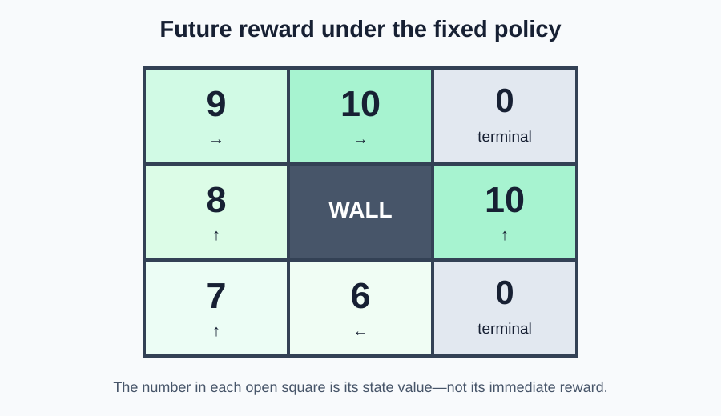

# Week 4 — Understand State Values

## Goal

Last week, you built a Gridworld that changes state after an action. A fixed
list supplied the movements, and the environment returned rewards.

This week, we will ask a new question:

> If a run begins in this square, how much reward is still ahead?

We will answer it for a fixed movement rule. The environment will remain
deterministic, so every result can be checked by hand.

By the end of the week, you will be able to:

- read a fixed policy as a dictionary of states and actions;
- distinguish an immediate reward from a future total;
- calculate a return by working backward through an episode;
- explain the specific meaning of state value;
- evaluate the same policy from every open Gridworld state;
- read a map of state values without treating it as a reward map.

You will build the project during the lecture. Each project exercise includes
a summary, a cumulative code stub, test code, and exact expected output.

## Start by comparing two squares

Recall the Week 3 board:

```text
S  .  +
.  #  .
.  .  -
```

The goal returns `10`, the trap returns `-10`, and every ordinary step returns
`-1`.

Compare these two starting squares when the next action is `"right"`:

```text
Start at (0, 0): right reaches (0, 1) and returns -1.
Start at (0, 1): right reaches the goal and returns 10.
```

Both squares display no reward by themselves. Their difference comes from
what happens after starting there.

## A policy is a choice rule

In everyday conversation, a **policy** is often an official rule. In this
lesson, a policy is the agent's rule for choosing an action.

We will use a fixed policy that always makes the same choice in the same state:

```text
→  →  goal
↑  #  ↑
↑  ←  trap
```

The matching Python dictionary is:

```python
# Match each nonterminal state to the action chosen there.
FIXED_POLICY = {
    (0, 0): "right",
    (0, 1): "right",
    (1, 0): "up",
    (1, 2): "up",
    (2, 0): "up",
    (2, 1): "left",
}

# Look up the choice made at one state.
action = FIXED_POLICY[(2, 1)]
print(action)
```

Expected output:

```text
left
```

The wall has no action because it cannot be entered. The goal and trap have no
actions because an episode ends upon entering either one.

### Inline exercise 1

Using the arrow map or dictionary, list the states visited when the run starts
at `(2, 1)`. Include the starting state and terminal state.

## Project exercise 1 — represent the fixed policy

### What this exercise depicts

This checkpoint separates the environment's movement rules from the agent's
choice rule. The environment decides what an action does; the policy decides
which action to request.

Begin with this stub:

```python
# TODO: Match each nonterminal open state to the arrow shown above.
FIXED_POLICY = {
}


def choose_action(policy, state):
    # TODO: Return the policy's action for this state.
    pass


# Test code: inspect three choices from different parts of the board.
if __name__ == "__main__":
    print("at (0, 0):", choose_action(FIXED_POLICY, (0, 0)))
    print("at (1, 2):", choose_action(FIXED_POLICY, (1, 2)))
    print("at (2, 1):", choose_action(FIXED_POLICY, (2, 1)))
```

Expected output:

```text
at (0, 0): right
at (1, 2): up
at (2, 1): left
```

## Immediate reward and future total

An **immediate reward** is the number returned by one action. A **future
total** adds all rewards from the current point until the episode ends.

Consider the route from `(0, 0)`:

```text
(0, 0) --right--> (0, 1), reward -1
(0, 1) --right--> (0, 2), reward 10
```

The immediate reward for the first action is `-1`. The future total from
`(0, 0)` is:

```text
-1 + 10 = 9
```

The future total from `(0, 1)` is only:

```text
10
```

The technical word for the future total produced by one episode is **return**.
Here, “return” does not mean a Python `return` statement or giving an item
back. It means the sum of rewards still ahead.

| Starting state | Rewards still ahead | Return |
|---|---|---:|
| `(0, 0)` | `-1, 10` | `9` |
| `(0, 1)` | `10` | `10` |
| `(0, 2)` | none—the episode is already over | `0` |

The terminal state's return is `0` because no rewards remain after the episode
has ended. The `10` was received while entering the terminal state.

### Inline exercise 2

A route has rewards `-1, -1, -1, 10`. What is the return from the beginning?
What is the return immediately before the final action?

## Calculate returns by working backward

An episode record stores rewards from first to last:

```python
# Each tuple stores state, action, next state, and reward.
history = [
    ((0, 0), "right", (0, 1), -1),
    ((0, 1), "right", (0, 2), 10),
]
```

Working backward makes each future total easy to update:

```text
begin with future total 0
read reward 10:  0 + 10 = 10
read reward -1: 10 + -1 = 9
```

The code follows the same order:

```python
def calculate_returns(history):
    # Begin after the episode, where no rewards remain.
    future_total = 0
    returns_by_state = {}

    # Read the transitions from last to first.
    for state, action, next_state, reward in reversed(history):
        # Add this reward to everything that comes after it.
        future_total = reward + future_total

        # Store the resulting return beside its starting state.
        returns_by_state[state] = future_total

    return returns_by_state
```

The names `action` and `next_state` remain in the loop because they explain the
shape of each transition, even though this calculation only needs `state` and
`reward`.

### Inline exercise 3

Work backward through rewards `-1, -1, 10`. Write the three running totals in
the order the loop calculates them, then match them to the forward states
`A, B, C`.

## Project exercise 2 — follow the policy and calculate returns

### What this exercise depicts

This checkpoint connects Week 3's environment to the fixed policy. It records
one episode from any starting state, then calculates how much reward remained
at each visited state.

Replace Exercise 1 with this cumulative stub. The `Gridworld` code is complete
because its behavior was the Week 3 project.

```python
class Gridworld:
    def __init__(self):
        # Reuse the board and movement rules from Week 3.
        self.rows = 3
        self.columns = 3
        self.start_state = (0, 0)
        self.wall_states = {(1, 1)}
        self.action_changes = {
            "up": (-1, 0),
            "down": (1, 0),
            "left": (0, -1),
            "right": (0, 1),
        }
        self.terminal_rewards = {
            (0, 2): 10,
            (2, 2): -10,
        }
        self.step_reward = -1
        self.state = self.start_state
        self.done = False

    def reset(self, start_state=None):
        # Use the usual start unless the caller supplies another open state.
        if start_state is None:
            start_state = self.start_state

        self.state = start_state
        self.done = start_state in self.terminal_rewards
        return self.state

    def is_inside(self, state):
        # Check both coordinates against the board shape.
        row, column = state
        return 0 <= row < self.rows and 0 <= column < self.columns

    def move(self, action):
        # Calculate and check the requested next state.
        if action not in self.action_changes:
            raise ValueError(f"Unknown action: {action}")

        row_change, column_change = self.action_changes[action]
        row, column = self.state
        candidate_state = (row + row_change, column + column_change)

        if (
            self.is_inside(candidate_state)
            and candidate_state not in self.wall_states
        ):
            self.state = candidate_state

        return self.state

    def step(self, action):
        # Apply one valid episode step.
        if self.done:
            raise RuntimeError("Episode is finished. Call reset().")

        next_state = self.move(action)
        reward = self.terminal_rewards.get(next_state, self.step_reward)
        self.done = next_state in self.terminal_rewards
        return next_state, reward, self.done


# Keep the completed policy from Exercise 1.
FIXED_POLICY = {
    (0, 0): "right",
    (0, 1): "right",
    (1, 0): "up",
    (1, 2): "up",
    (2, 0): "up",
    (2, 1): "left",
}


def follow_policy(world, policy, start_state):
    # TODO: Reset at start_state and create an empty history.

    # TODO: Choose, step, and record until the episode is done.

    # TODO: Return the history.
    raise NotImplementedError


def calculate_returns(history):
    # TODO: Begin with a future total of zero.

    # TODO: Read the history backward and update the future total.

    # TODO: Return a dictionary matching states to returns.
    raise NotImplementedError


# Test code: evaluate the route from the bottom-middle state.
if __name__ == "__main__":
    test_world = Gridworld()
    test_history = follow_policy(
        test_world,
        FIXED_POLICY,
        start_state=(2, 1),
    )

    for transition in test_history:
        print(transition)

    print("returns:", calculate_returns(test_history))
```

Expected output:

```text
((2, 1), 'left', (2, 0), -1)
((2, 0), 'up', (1, 0), -1)
((1, 0), 'up', (0, 0), -1)
((0, 0), 'right', (0, 1), -1)
((0, 1), 'right', (0, 2), 10)
returns: {(0, 1): 10, (0, 0): 9, (1, 0): 8, (2, 0): 7, (2, 1): 6}
```

Python displays the dictionary in the order entries were added: from the end
of the route back toward its beginning.

## From one return to a state value

A return describes what happened after one particular start. A **state value**
describes the future reward we expect when we start in that state and follow a
particular policy.

This sentence has three important parts:

```text
value of a state = expected future reward under a policy
```

- **state** tells us where the run begins;
- **future reward** tells us what is being measured;
- **under a policy** tells us how future actions will be chosen.

In this deterministic lesson, the same start and policy always produce the
same route. The return from one run therefore gives the exact value. When
outcomes vary, “expected” means an average across many runs. That is Week 5.

Value is not stored inside the square. Changing the policy can change a
state's value even when the board and rewards stay unchanged.

### Inline exercise 4

Why is the phrase “the value of `(0, 0)` is `9`” incomplete unless everyone
knows which policy is being followed?

## Evaluate every state

We can start a separate run from every open square:

```python
def evaluate_policy(world, policy):
    # Start an empty value table.
    values = {}

    for row in range(world.rows):
        for column in range(world.columns):
            state = (row, column)

            # Walls are not possible starting states.
            if state in world.wall_states:
                continue

            # Terminal states have no future rewards after entry.
            if state in world.terminal_rewards:
                values[state] = 0
                continue

            # Follow the policy and keep the return from this start.
            history = follow_policy(world, policy, state)
            returns = calculate_returns(history)
            values[state] = returns[state]

    return values
```

The resulting value map is:



Read it as a future-reward map, not an immediate-reward map. For example,
`(2, 1)` has value `6` because five rewards remain:

```text
-1 + -1 + -1 + -1 + 10 = 6
```

### Inline exercise 5

Why do `(0, 1)` and `(1, 2)` both have value `10`, even though they are
different squares?

## Project exercise 3 — build the complete value map

### What this exercise depicts

This checkpoint repeats the same careful evaluation from every possible open
state. It turns individual route calculations into one state-value table.

Keep the completed code from Exercise 2 and add:

```python
def evaluate_policy(world, policy):
    # TODO: Create an empty values dictionary.

    # TODO: Visit every row and column on the board.

    # TODO: Skip the wall and assign zero to terminal states.

    # TODO: Follow the policy from each remaining state.

    # TODO: Store and return each starting state's return.
    raise NotImplementedError


def print_value_map(world, values):
    # Build one printable row at a time.
    for row in range(world.rows):
        cells = []

        for column in range(world.columns):
            state = (row, column)

            # Display the wall instead of a number.
            if state in world.wall_states:
                cells.append("  #")
            else:
                cells.append(f"{values[state]:3}")

        print(" ".join(cells))


# Test code: print the complete deterministic value map.
if __name__ == "__main__":
    test_world = Gridworld()
    test_values = evaluate_policy(test_world, FIXED_POLICY)
    print_value_map(test_world, test_values)
```

Expected output:

```text
  9  10   0
  8   #  10
  7   6   0
```

## Completed project

Your final program should:

1. represent the fixed arrow policy with a dictionary;
2. follow that policy from any open state;
3. record the resulting episode;
4. calculate returns by reading rewards backward;
5. treat terminal-state values as zero;
6. evaluate every open state under the same policy;
7. print the resulting value map.

The reference implementation is in `solutions/project_solution.py`.

## Optional stretch — change one policy choice

Change the action at `(2, 1)` from `"left"` to `"right"`.

Run `evaluate_policy` again and compare the two maps. The new route enters the
trap immediately, so the new value at `(2, 1)` should be `-10`. Other states
whose routes pass through `(2, 1)` would also change; in this policy, none do.

This demonstrates an important point: values describe both an environment and
a policy, not the board alone.

## Topic backlog — useful, but not this week

- **Learning from samples:** This week can calculate exact values because the
  environment and policy are deterministic. Next week will estimate values
  from repeated episodes with different outcomes.
- **Discounting:** Some methods give distant rewards less weight. We are using
  ordinary totals first so every number can be checked with addition.
- **Action value:** State value asks about a starting state under a policy.
  Later, action value will compare specific actions from that state.
- **Bellman equations:** A state's value can be related to the next state's
  value. We will build that relationship from code rather than start with a
  formula.
- **Improving the policy:** This week measures one fixed policy; it does not
  search for the best policy.

## Wrap-up

- What is the difference between one reward and a return?
- Why does calculating returns backward help?
- Why is a terminal state's value zero even when entering it returned `10`?
- What does the word “expected” add to the definition of value?
- Why must a state value name or assume a policy?
- What would change if one arrow in the policy changed?
- Which values can be verified directly from the arrow map?

## Next week

This week, one deterministic route revealed an exact value. Next week, the
same starting state can lead to different episodes. An agent will remember the
returns it observes and learn a state-value estimate by averaging them.

## Common misunderstandings to watch for

- **“Value is the reward printed in a square.”** Value includes all rewards
  still ahead under a policy.
- **“Return means a Python `return` statement.”** Here, return means the future
  reward total from one point in an episode.
- **“The goal must have value `10`.”** Entering the goal returns `10`; after
  entry, the episode is over and no future reward remains.
- **“A state has one permanent value.”** Its value can change when the policy,
  rewards, or movement rules change.
- **“The largest immediate reward and largest value are always identical.”**
  Value can include several future rewards.
- **“The code learned these values.”** This week calculates them from known,
  deterministic routes. Learning from sampled episodes begins next week.
