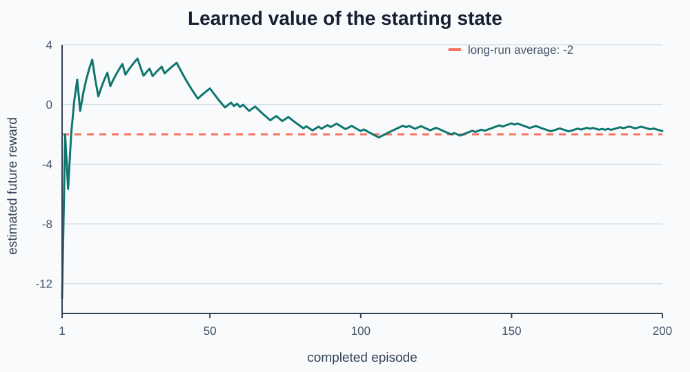

# Week 5 — Learn State Values from Episodes

## Goal

Last week, a deterministic policy always produced the same route. One episode
was enough to calculate an exact state value.

This week, the starting state has two possible choices. One route reaches the
goal and the other reaches the trap. The agent will not know in advance which
return it will observe on a particular episode.

It will learn by remembering complete episodes and averaging their returns.

By the end of the week, you will be able to:

- collect one complete episode before learning from it;
- calculate one return sample for every visited state;
- store counts, total returns, and value estimates by state;
- update a state-value estimate with an ordinary average;
- explain why one episode is weak evidence;
- interpret a graph of an estimate changing across episodes.

Each project checkpoint includes a cumulative code stub, test code, and exact
expected output.

## Reuse the Gridworld environment

The environment's job is unchanged. It applies movement rules and returns a
state, reward, and ending signal. The new work will happen in the agent and
training loop.

```python
class Gridworld:
    def __init__(self):
        # Reuse the board from Weeks 3 and 4.
        self.rows = 3
        self.columns = 3
        self.start_state = (0, 0)
        self.wall_states = {(1, 1)}
        self.action_changes = {
            "up": (-1, 0),
            "down": (1, 0),
            "left": (0, -1),
            "right": (0, 1),
        }
        self.terminal_rewards = {
            (0, 2): 10,
            (2, 2): -10,
        }
        self.step_reward = -1
        self.state = self.start_state
        self.done = False

    def reset(self):
        # Begin a new episode at the starting state.
        self.state = self.start_state
        self.done = False
        return self.state

    def is_inside(self, state):
        # Check both coordinates against the board shape.
        row, column = state
        return 0 <= row < self.rows and 0 <= column < self.columns

    def move(self, action):
        # Calculate the requested next state.
        if action not in self.action_changes:
            raise ValueError(f"Unknown action: {action}")

        row_change, column_change = self.action_changes[action]
        row, column = self.state
        candidate_state = (row + row_change, column + column_change)

        # Move only when the request passes both barrier checks.
        if (
            self.is_inside(candidate_state)
            and candidate_state not in self.wall_states
        ):
            self.state = candidate_state

        return self.state

    def step(self, action):
        # Apply one action during an unfinished episode.
        if self.done:
            raise RuntimeError("Episode is finished. Call reset().")

        next_state = self.move(action)
        reward = self.terminal_rewards.get(next_state, self.step_reward)
        self.done = next_state in self.terminal_rewards
        return next_state, reward, self.done
```

## Start with two possible routes

We will reuse the same Gridworld:

```text
S  .  +
.  #  .
.  .  -
```

The action at the starting state is chosen randomly between `"right"` and
`"down"`. Every later action is fixed:

```text
At (0, 0): choose right or down with equal chance.

If right: (0, 0) → (0, 1) → goal
If down:  (0, 0) → (1, 0) → (2, 0) → (2, 1) → trap
```

The two possible start-state returns are:

| First action | Rewards | Return |
|---|---|---:|
| `"right"` | `-1, 10` | `9` |
| `"down"` | `-1, -1, -1, -10` | `-13` |

### Inline exercise 1

Why does the first action determine the complete route in this example? What
are the only two possible episode returns from `(0, 0)`?

## Expected does not mean guaranteed

In Week 4, state value meant the future reward we **expect** under a policy.
When outcomes vary, “expect” means the long-run average—not a promise about one
episode.

The two first actions are equally likely. If they occurred equally often, the
average start return would be:

```text
(9 + -13) / 2 = -2
```

No individual episode returns `-2`. Each returns either `9` or `-13`. The
number `-2` describes the balance across many episodes.

### Inline exercise 2

Suppose four episodes return `9, -13, 9, -13`. What is their average? Does that
average describe the reward from any one of the four episodes?

## First ability: choose from a small policy

The policy stores a tuple of allowed actions for each state:

```python
from random import Random


class StateValueAgent:
    def __init__(self, seed=None):
        # The start has two choices; later states have one choice.
        self.action_choices = {
            (0, 0): ("right", "down"),
            (0, 1): ("right",),
            (1, 0): ("down",),
            (1, 2): ("up",),
            (2, 0): ("right",),
            (2, 1): ("right",),
        }

        # Use a seed so tests can repeat the same choices.
        self.randomizer = Random(seed)

    def choose_action(self, state):
        # Look up the actions allowed by the policy.
        choices = self.action_choices[state]

        # Avoid a random draw when there is only one possible action.
        if len(choices) == 1:
            return choices[0]

        # Randomly choose when the policy allows multiple actions.
        return self.randomizer.choice(choices)
```

This agent is not improving its action choices. It follows one unchanging
policy while learning how much future reward that policy produces.

## Project exercise 1 — follow the branching policy

### What this exercise depicts

This checkpoint creates predictable variation. The first action can select one
of two routes, while every later state has one clear action.

Begin with this stub:

```python
from random import Random


class StateValueAgent:
    def __init__(self, seed=None):
        # TODO: Store the action choices shown above.
        self.action_choices = {
        }

        # Create a repeatable random-number generator.
        self.randomizer = Random(seed)

    def choose_action(self, state):
        # TODO: Look up the choices for state.

        # TODO: Return the only choice without drawing randomly.

        # TODO: Otherwise return one random choice.
        raise NotImplementedError


# Test code: request the starting choice eight times.
if __name__ == "__main__":
    test_agent = StateValueAgent(seed=7)

    choices = [
        test_agent.choose_action((0, 0))
        for _ in range(8)
    ]

    print(choices)
    print("choice at (2, 0):", test_agent.choose_action((2, 0)))
```

Expected output:

```text
['down', 'right', 'down', 'right', 'right', 'right', 'down', 'right']
choice at (2, 0): right
```

The seed makes this test repeatable. It does not make one route permanently
better or change the policy's equal choice at the start.

## Second ability: turn an episode into samples

The goal episode is:

```python
goal_history = [
    ((0, 0), "right", (0, 1), -1),
    ((0, 1), "right", (0, 2), 10),
]
```

Reading backward produces one return sample for every state:

```text
(0, 1) receives sample 10
(0, 0) receives sample 9
```

The trap episode has four samples:

```text
forward rewards:  -1,  -1,  -1, -10
backward totals: -10, -11, -12, -13

(2, 1) receives sample -10
(2, 0) receives sample -11
(1, 0) receives sample -12
(0, 0) receives sample -13
```

### Inline exercise 3

Why does `(0, 0)` receive `-13` from the trap episode rather than only the
first reward, `-1`?

## Reuse the bandit average

In Week 2, every arm stored three numbers:

```text
count, total reward, estimated reward
```

We can use the same idea for each state:

```text
count, total return, estimated value
```

The learner begins with no samples:

```python
# Make one zero record for every nonterminal state.
states = self.action_choices
self.counts = {state: 0 for state in states}
self.total_returns = {state: 0.0 for state in states}
self.values = {state: 0.0 for state in states}
```

After calculating a return, the update is an ordinary average:

```python
# Record one more return sample for this state.
self.counts[state] += 1
self.total_returns[state] += future_total

# Recalculate the average of all return samples seen here.
self.values[state] = (
    self.total_returns[state] / self.counts[state]
)
```

The value is an **estimate** because a limited sample of random episodes may
not match the long-run average exactly.

### Inline exercise 4

A state has three return samples with an average of `5`. Its next return sample
is `-1`. What are its new count, total return, and value estimate?

## Learn only after the episode is complete

The return from an early state includes rewards that have not happened yet.
The learner therefore waits until the episode ends, then works backward:

```python
def learn_from_episode(self, history):
    # Begin after the ending, where no reward remains.
    future_total = 0

    # Move from the final transition toward the first.
    for state, action, next_state, reward in reversed(history):
        # Build this state's return sample.
        future_total = reward + future_total

        # Add the sample to this state's records.
        self.counts[state] += 1
        self.total_returns[state] += future_total
        self.values[state] = (
            self.total_returns[state] / self.counts[state]
        )
```

Learning from complete sampled episodes is called a **Monte Carlo method**.
The name comes after the concrete process:

```text
finish an episode → calculate its returns → update averages
```

No casino knowledge is required. Here, Monte Carlo simply signals that random
complete samples are being averaged.

## Project exercise 2 — learn from two known episodes

### What this exercise depicts

This checkpoint isolates the learning update from the environment. Two
handwritten episodes make every count, total, and estimate checkable.

Keep the action choices and `choose_action` from Exercise 1, then add:

```python
class StateValueAgent:
    def __init__(self, seed=None):
        # Keep the completed branching policy from Exercise 1.
        self.action_choices = {
            (0, 0): ("right", "down"),
            (0, 1): ("right",),
            (1, 0): ("down",),
            (1, 2): ("up",),
            (2, 0): ("right",),
            (2, 1): ("right",),
        }
        self.randomizer = Random(seed)

        # TODO: Create zero counts for all states in action_choices.

        # TODO: Create zero total returns for the same states.

        # TODO: Create zero value estimates for the same states.

    def choose_action(self, state):
        # Keep the completed choice rule from Exercise 1.
        choices = self.action_choices[state]
        if len(choices) == 1:
            return choices[0]
        return self.randomizer.choice(choices)

    def learn_from_episode(self, history):
        # TODO: Begin with a future total of zero.

        # TODO: Read the episode backward.

        # TODO: Update the return, count, total, and value.
        pass


# Test code: learn once from each possible route.
if __name__ == "__main__":
    test_agent = StateValueAgent(seed=7)

    goal_history = [
        ((0, 0), "right", (0, 1), -1),
        ((0, 1), "right", (0, 2), 10),
    ]
    trap_history = [
        ((0, 0), "down", (1, 0), -1),
        ((1, 0), "down", (2, 0), -1),
        ((2, 0), "right", (2, 1), -1),
        ((2, 1), "right", (2, 2), -10),
    ]

    test_agent.learn_from_episode(goal_history)
    test_agent.learn_from_episode(trap_history)

    print("start count:", test_agent.counts[(0, 0)])
    print("start total:", test_agent.total_returns[(0, 0)])
    print("start value:", test_agent.values[(0, 0)])
    print("goal-side value:", test_agent.values[(0, 1)])
    print("trap-side value:", test_agent.values[(1, 0)])
```

Expected output:

```text
start count: 2
start total: -4.0
start value: -2.0
goal-side value: 10.0
trap-side value: -12.0
```

## Connect experience and learning

One episode has two phases:

```text
collect: choose → step → record → repeat until done
learn:   read the completed record backward → update values
```

The code keeps that boundary visible:

```python
def run_episode(world, agent):
    # Start a new environment episode and empty record.
    state = world.reset()
    history = []
    total_reward = 0

    while not world.done:
        # Collect one transition using the current policy.
        action = agent.choose_action(state)
        next_state, reward, done = world.step(action)
        history.append((state, action, next_state, reward))
        total_reward += reward
        state = next_state

    # Learn only after every reward in the episode is known.
    agent.learn_from_episode(history)
    return history, total_reward
```

## Project exercise 3 — learn across many episodes

### What this exercise depicts

This checkpoint connects the Week 3 environment, the branching policy, and the
Week 5 learner. Repeated episodes turn individual returns into increasingly
stable averages.

Use the completed `Gridworld` from Week 4 and the completed `StateValueAgent`
from Exercise 2. Add these functions:

```python
def run_episode(world, agent):
    # TODO: Reset the world and create an empty history and reward total.

    # TODO: Choose, step, and record until done.

    # TODO: Ask the agent to learn from the completed history.

    # TODO: Return the history and episode reward.
    raise NotImplementedError


def train(world, agent, number_of_episodes):
    # Create records for completed episode scores and start estimates.
    episode_rewards = []
    start_value_history = []

    # TODO: Run the requested number of episodes.

    # TODO: Record each score and current start-state estimate.

    # TODO: Return both records.
    raise NotImplementedError


# Test code: use a seed so the exact sample is repeatable.
if __name__ == "__main__":
    test_world = Gridworld()
    test_agent = StateValueAgent(seed=7)

    rewards, start_values = train(
        test_world,
        test_agent,
        number_of_episodes=200,
    )

    print("goal episodes:", rewards.count(9))
    print("trap episodes:", rewards.count(-13))
    print("start count:  ", test_agent.counts[(0, 0)])
    print("start value:  ", round(test_agent.values[(0, 0)], 2))
    print("unvisited count:", test_agent.counts[(1, 2)])
```

Expected output:

```text
goal episodes: 102
trap episodes: 98
start count:   200
start value:   -1.78
unvisited count: 0
```

The estimate is close to `-2`, but it is not exactly `-2` because this sample
contains 102 goal episodes and 98 trap episodes.

## Watch the estimate change

The first eight start-state estimates for seed `7` are approximately:

```text
-13.00, -2.00, -5.67, -2.00, 0.20, 1.67, -0.43, 0.75
```

Early estimates move sharply because each new episode is a large part of the
available evidence. Later episodes usually change the average less.



The dashed line marks `-2`, the average of the two equally likely returns. The
agent does not read that line. It only receives sampled episodes.

The matching plotting code is:

```python
import matplotlib.pyplot as plt


# Number the completed episodes starting at one.
episodes = range(1, len(start_value_history) + 1)

# Plot the estimate stored after each episode.
plt.plot(episodes, start_value_history, color="teal")

# Mark the known long-run average for comparison.
plt.axhline(-2, color="coral", linestyle="--")

plt.xlabel("completed episode")
plt.ylabel("estimated future reward")
plt.show()
```

> **Data lesson:** One episode can produce either `9` or `-13`, so one episode
> cannot reveal the long-run value. Counts show how much evidence supports an
> estimate. Always inspect them beside learned values.

### Inline exercise 5

After 200 episodes, `(1, 2)` still has count `0` and estimated value `0.0`.
Why does that zero not prove the state's true value is zero?

## Words with specific meanings

| Word | Familiar meaning | Specific meaning in this lesson |
|---|---|---|
| **Sample** | One item from a larger group | One observed return for one state |
| **Estimate** | A guess based on information | The average return observed for a state |
| **Episode** | One part of a series | One run from reset until a terminal state |
| **Expected** | Anticipated | The long-run average across repeated outcomes |
| **Monte Carlo** | Often associated with a place or casino | Learning by averaging complete random samples |

## Completed project

Your final program should:

1. reuse the Gridworld environment;
2. choose between two routes at the starting state;
3. record complete episodes;
4. calculate return samples by working backward;
5. store counts, total returns, and value estimates by state;
6. update values only after an episode ends;
7. train for 200 episodes and graph the starting estimate.

The reference implementation is in `solutions/project_solution.py`.

## Optional stretch — compare sample sizes

Run fresh agents for `2`, `10`, `50`, and `200` episodes, always using seed
`7`. Record the start-state estimate and count for each run.

Do not conclude that a larger sample must be closer on every seed. Instead,
look for the general pattern: larger samples usually make the estimate less
sensitive to one additional episode. Repeating the comparison with several
seeds belongs in a later evaluation lesson.

## Topic backlog — useful, but not this week

- **First-visit and every-visit learning:** Our routes never revisit a state,
  so both rules would produce the same update. We will name the distinction
  when an environment can loop back.
- **Discounting:** We still add ordinary rewards. Later, distant rewards can
  receive less weight.
- **Learning before the episode ends:** This method waits for a complete
  return. Next week, we can ask whether the next state's estimate provides an
  earlier learning signal.
- **Improving the policy:** The agent evaluates one fixed branching policy. It
  does not yet change its choices using the learned values.
- **Fair comparisons:** One seed is useful for exact tests, but several seeds
  are needed before making a broad claim about learning behavior.

## Wrap-up

- Why can the same starting state produce two returns?
- What is the difference between a return sample and a value estimate?
- Why does the learner work backward through an episode?
- Which Week 2 averaging idea reappears here?
- Why does the estimate move more during early episodes?
- What does a count of zero tell us?
- What makes this an episode-based learning method?
- Which part of the program chooses actions, and which part updates values?

## Next week

This week, the learner waited until an episode ended before updating any
values. Next week, we can investigate learning after each step by using the
next state's current estimate. That creates a careful comparison between
complete-return learning and step-by-step learning.

## Common misunderstandings to watch for

- **“The expected value is a guaranteed episode score.”** Individual episodes
  still return `9` or `-13`; `-2` describes their long-run balance.
- **“The most recent return replaces the value.”** The value is the average of
  all recorded returns for that state.
- **“Every state receives one sample per episode.”** Only visited states are
  updated.
- **“A zero estimate proves a state is neutral.”** A zero count means the
  estimate has no supporting samples.
- **“Monte Carlo requires advanced probability.”** This implementation uses
  complete episodes, backward addition, counts, and ordinary averages.
- **“The policy is learning to avoid the trap.”** The policy remains fixed;
  only its state-value estimates change.
- **“Two hundred episodes reveal the exact value.”** They provide a larger
  sample, not certainty.
