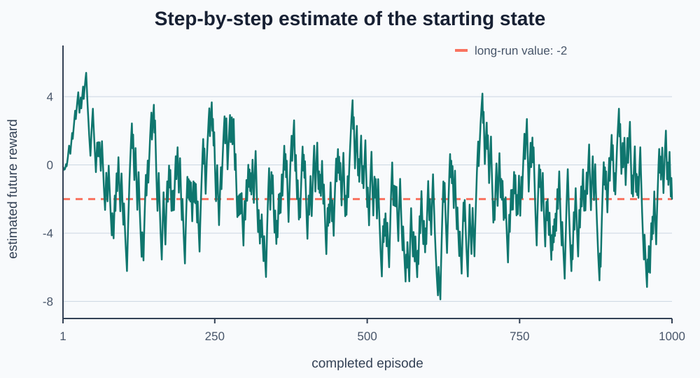

# Week 6 — Learn State Values After Each Step

## Goal

In Week 5, the learner waited for an episode to end. It then worked backward,
calculated complete returns, and updated state-value estimates.

This week asks:

> Can a state learn something before the episode is over?

The answer is yes if the learner uses the next state's current estimate. We
will build that idea one transition at a time before giving it a technical
name.

By the end of the week, you will be able to:

- build a learning target from one reward and one next-state estimate;
- handle terminal transitions without adding a future estimate;
- move a value estimate partway toward a target;
- explain what a learning rate changes;
- update values immediately after each environment step;
- compare complete-episode and step-by-step learning.

Each project checkpoint includes a cumulative code stub, test code, and exact
expected output.

## Reuse the same environment and policy

The board, rewards, and branching policy remain unchanged:

```text
S  .  +
.  #  .
.  .  -

At (0, 0): choose right or down with equal chance.
After that: follow the fixed route to the goal or trap.
```

Keeping them unchanged makes the comparison fair. Only the learning update is
new.

```python
class Gridworld:
    def __init__(self):
        # Reuse the board and movement rules from earlier weeks.
        self.rows = 3
        self.columns = 3
        self.start_state = (0, 0)
        self.wall_states = {(1, 1)}
        self.action_changes = {
            "up": (-1, 0),
            "down": (1, 0),
            "left": (0, -1),
            "right": (0, 1),
        }
        self.terminal_rewards = {
            (0, 2): 10,
            (2, 2): -10,
        }
        self.step_reward = -1
        self.state = self.start_state
        self.done = False

    def reset(self):
        # Begin a new episode at the starting state.
        self.state = self.start_state
        self.done = False
        return self.state

    def is_inside(self, state):
        # Check both coordinates against the board shape.
        row, column = state
        return 0 <= row < self.rows and 0 <= column < self.columns

    def move(self, action):
        # Calculate the requested next state.
        if action not in self.action_changes:
            raise ValueError(f"Unknown action: {action}")

        row_change, column_change = self.action_changes[action]
        row, column = self.state
        candidate_state = (row + row_change, column + column_change)

        # Move only when the requested state passes both barrier checks.
        if (
            self.is_inside(candidate_state)
            and candidate_state not in self.wall_states
        ):
            self.state = candidate_state

        return self.state

    def step(self, action):
        # Apply one action during an unfinished episode.
        if self.done:
            raise RuntimeError("Episode is finished. Call reset().")

        next_state = self.move(action)
        reward = self.terminal_rewards.get(next_state, self.step_reward)
        self.done = next_state in self.terminal_rewards
        return next_state, reward, self.done
```

## Start with one transition

Suppose the learner observes:

```text
state:                 (0, 0)
action:                "right"
reward:                -1
next state:            (0, 1)
current next value:     6
```

The reward says what happened now. The next value estimates what reward is
still ahead. Add them:

```text
-1 + 6 = 5
```

The learner will use `5` as a temporary destination for the current state's
estimate.

In ordinary conversation, a **target** is something to aim toward. Here, a
**learning target** is the number an estimate moves toward during one update.

```text
one-step target = reward + next state's current value estimate
```

This is not the complete return. It combines one observed reward with one
estimate.

### Inline exercise 1

Calculate the target for each transition:

1. reward `-1`, next value `6`, and `done=False`;
2. reward `10`, next value `999`, and `done=True`.

Why should the second calculation ignore `999`?

## Terminal transitions stop the future

After entering a terminal state, no rewards remain. Its future value is zero:

```python
def one_step_target(reward, next_value, done):
    # A terminal transition has no future estimate to add.
    if done:
        return reward

    # An ordinary transition uses now plus the estimated future.
    return reward + next_value
```

Passing `next_value` even for a terminal transition keeps one consistent
function shape. The `done` check decides whether that estimate is meaningful.

## Project exercise 1 — build a one-step target

### What this exercise depicts

This checkpoint isolates the new source of information. It combines the reward
from one transition with what the learner currently believes about the next
state.

Begin with this stub:

```python
def one_step_target(reward, next_value, done):
    # TODO: Return only reward when the episode is done.

    # TODO: Otherwise return reward plus next_value.
    raise NotImplementedError


# Test code: compare an ordinary and terminal transition.
if __name__ == "__main__":
    print(
        "ordinary target:",
        one_step_target(reward=-1, next_value=6, done=False),
    )
    print(
        "terminal target:",
        one_step_target(reward=10, next_value=999, done=True),
    )
```

Expected output:

```text
ordinary target: 5
terminal target: 10
```

## Move partway instead of replacing

Suppose a state's current estimate is `2` and its new target is `8`.
Replacing `2` with `8` would let one transition completely overwrite earlier
experience. Instead, move partway across the gap:

```text
current estimate: 2
target:           8
gap:              8 - 2 = 6
```

A `learning_rate` of `0.25` means move one-quarter of that gap:

```text
change:       0.25 × 6 = 1.5
new estimate: 2 + 1.5 = 3.5
```

The learning rate is a fraction between `0.0` and `1.0`:

| Learning rate | Effect during one update |
|---:|---|
| `0.0` | Move none of the gap |
| `0.1` | Move one-tenth of the gap |
| `0.5` | Move halfway across the gap |
| `1.0` | Move all the way to the latest target |

It is not the chance that learning succeeds. It controls the size of each
change.

### Inline exercise 2

The current estimate is `2`, the target is `8`, and the learning rate is
`0.25`. Calculate the gap, change, and new estimate.

## The matching update code

```python
def learn(self, state, reward, next_state, done):
    # Terminal states contribute no future estimate.
    if done:
        next_value = 0.0
    else:
        next_value = self.values[next_state]

    # Build the one-step learning target.
    target = one_step_target(reward, next_value, done)

    # Measure the gap between the target and current estimate.
    gap = target - self.values[state]

    # Move only the chosen fraction of that gap.
    change = self.learning_rate * gap
    self.values[state] += change
    self.counts[state] += 1

    return target
```

Read it in the same order as the English:

```text
find next value → build target → measure gap → scale gap → update
```

The gap is commonly called the **temporal-difference error**. Here, “error”
means the difference used for an update. It does not necessarily mean the
program has a bug.

## Project exercise 2 — update one state estimate

### What this exercise depicts

This checkpoint gives the agent value memory and one-step learning. Hand-picked
transitions keep every target and update easy to inspect.

Replace Exercise 1 with this cumulative stub:

```python
from random import Random


def one_step_target(reward, next_value, done):
    # Keep the completed target from Exercise 1.
    if done:
        return reward
    return reward + next_value


class StepValueAgent:
    def __init__(self, learning_rate=0.1, seed=None):
        # Reuse the fixed branching policy from Week 5.
        self.action_choices = {
            (0, 0): ("right", "down"),
            (0, 1): ("right",),
            (1, 0): ("down",),
            (1, 2): ("up",),
            (2, 0): ("right",),
            (2, 1): ("right",),
        }
        self.randomizer = Random(seed)
        self.learning_rate = learning_rate

        # Create zero estimates and counts for every nonterminal state.
        self.values = {
            state: 0.0
            for state in self.action_choices
        }
        self.counts = {
            state: 0
            for state in self.action_choices
        }

    def choose_action(self, state):
        # Keep the Week 5 action-choice rule.
        choices = self.action_choices[state]
        if len(choices) == 1:
            return choices[0]
        return self.randomizer.choice(choices)

    def learn(self, state, reward, next_state, done):
        # TODO: Use zero next value if done, otherwise look it up.

        # TODO: Build the target and its gap from the current value.

        # TODO: Move learning_rate times the gap.

        # TODO: Increase this state's update count and return the target.
        raise NotImplementedError


# Test code: first improve the goal-side state, then update the start.
if __name__ == "__main__":
    test_agent = StepValueAgent(learning_rate=0.5, seed=7)

    goal_target = test_agent.learn(
        state=(0, 1),
        reward=10,
        next_state=(0, 2),
        done=True,
    )
    start_target = test_agent.learn(
        state=(0, 0),
        reward=-1,
        next_state=(0, 1),
        done=False,
    )

    print("goal target:", goal_target)
    print("goal-side value:", test_agent.values[(0, 1)])
    print("start target:", start_target)
    print("start value:", test_agent.values[(0, 0)])
```

Expected output:

```text
goal target: 10
goal-side value: 5.0
start target: 4.0
start value: 2.0
```

The start target is `-1 + 5 = 4`. Its new estimate moves halfway from `0` to
`4`, producing `2`.

## Information moves backward over time

Now imagine a goal episode when every estimate begins at zero.

The first transition is:

```text
(0, 0) --right, reward -1--> (0, 1)
```

At that moment, `(0, 1)` still has estimate `0`, so the start target is:

```text
-1 + 0 = -1
```

Later in the same episode, entering the goal moves `(0, 1)` toward `10`.
The starting state does not travel backward in time and redo its update. A
future visit can use the improved `(0, 1)` estimate.

```text
goal reward teaches (0, 1)
later episodes let (0, 1) teach (0, 0)
```

### Inline exercise 3

Why can the starting estimate move toward `-1` during the first successful
goal episode even though that complete episode returns `9`?

## Learn inside the interaction loop

Week 5 learned after the `while` loop. This week, `learn` belongs inside it:

```python
def run_episode(world, agent):
    # Start a new episode and empty records.
    state = world.reset()
    history = []
    total_reward = 0

    while not world.done:
        # Collect one environment transition.
        action = agent.choose_action(state)
        next_state, reward, done = world.step(action)

        # Learn immediately from this transition.
        agent.learn(state, reward, next_state, done)

        # Keep records for inspection, then continue.
        history.append((state, action, next_state, reward))
        total_reward += reward
        state = next_state

    return history, total_reward
```

The agent no longer needs the complete history for its update. We still record
history because it helps us inspect and test what happened.

## Name the method after understanding it

The update compares estimates at two neighboring times: the current state and
the next state. It is called **temporal-difference learning**, often shortened
to **TD learning**.

It also uses one estimate to improve another estimate. That is called
**bootstrapping**. This is a technical use of the word; no physical bootstraps
are involved.

The specific method in this lesson is often written **TD(0)**. Remembering the
label is less important than being able to trace:

```text
reward + next estimate → target → partial update
```

### Inline exercise 4

Compare update timing in one sentence: when does the Week 5 complete-return
learner update, and when does the Week 6 step learner update? What information
does each use as its target?

## Project exercise 3 — train with step updates

### What this exercise depicts

This checkpoint connects the unchanged Gridworld and policy to the new update.
The agent learns during every episode rather than waiting until its end.

Keep the completed `Gridworld`, `one_step_target`, and `StepValueAgent`. Add:

```python
def run_episode(world, agent):
    # TODO: Reset the world and create history and reward records.

    # TODO: Choose and step until the episode ends.

    # TODO: Call agent.learn immediately after every step.

    # TODO: Record each transition and return the episode records.
    raise NotImplementedError


def train(world, agent, number_of_episodes):
    # Create records for episode scores and start estimates.
    episode_rewards = []
    start_value_history = []

    # TODO: Run complete episodes while learning after each step.

    # TODO: Record each score and current start-state estimate.

    # TODO: Return both records.
    raise NotImplementedError


# Test code: train long enough for information to move through both routes.
if __name__ == "__main__":
    test_world = Gridworld()
    test_agent = StepValueAgent(learning_rate=0.1, seed=7)

    rewards, start_values = train(
        test_world,
        test_agent,
        number_of_episodes=1000,
    )

    print("goal episodes:", rewards.count(9))
    print("trap episodes:", rewards.count(-13))
    print("start updates:", test_agent.counts[(0, 0)])
    print("start value:  ", round(test_agent.values[(0, 0)], 2))
    print("goal-side value:", round(test_agent.values[(0, 1)], 2))
    print("trap-side value:", round(test_agent.values[(1, 0)], 2))
```

Expected output:

```text
goal episodes: 511
trap episodes: 489
start updates: 1000
start value:   -1.99
goal-side value: 10.0
trap-side value: -12.0
```

The same seeded policy generated 511 goal routes and 489 trap routes. The
goal-side and trap-side estimates have received enough repeated updates to
reach their future rewards closely.

### Inline exercise 5

Why does the start have `1000` updates, the goal-side state have `511`, and the
trap-side state have `489`? Do larger counts mean those states are better?

## Watch step-by-step learning



The line initially changes slowly because useful terminal information must move
back through neighboring estimates. Later it moves around the long-run value
as new goal and trap episodes arrive.

The dashed line at `-2` is for evaluation. The agent does not read it.

## Compare Weeks 5 and 6

| Question | Week 5: complete return | Week 6: one-step target |
|---|---|---|
| When can it update? | After the episode ends | After every transition |
| What is the target? | All remaining sampled rewards | One reward plus the next estimate |
| Must it keep the episode for learning? | Yes | No |
| Does its target depend on another estimate? | No | Yes |
| Can terminal information move backward gradually? | The full return carries it at once | Repeated updates pass it state to state |

Neither table column is automatically “the winner.” They use different
information and can behave differently across environments.

> **Training lesson:** Step-by-step learning can update sooner, but “sooner”
> does not mean “immediately correct.” Early next-state estimates may be poor.
> Inspect update counts and how information moves through connected states.

## Words with specific meanings

| Word | Familiar meaning | Specific meaning in this lesson |
|---|---|---|
| **Target** | Something aimed at | The number a value estimate moves toward |
| **Error** | Often a mistake or bug | The target minus the current estimate |
| **Learning rate** | Could sound like speed | The fraction of the update gap used now |
| **Temporal difference** | A difference across time | A comparison using current and next-state estimates |
| **Bootstrapping** | Often starting with limited resources | Using one estimate to update another estimate |

## Completed project

Your final program should:

1. reuse the Gridworld and branching policy;
2. calculate ordinary and terminal one-step targets;
3. store a learning rate, values, and update counts;
4. move each visited state's estimate partway toward its target;
5. update immediately after every environment step;
6. train for 1000 episodes with a repeatable seed;
7. graph the starting estimate and inspect state update counts.

The reference implementation is in `solutions/project_solution.py`.

## Optional stretch — compare learning rates

Train fresh agents using learning rates `0.01`, `0.1`, and `0.5`. Keep seed `7`
and 1000 episodes fixed. Plot all three start-value histories on one graph.

Record:

- how quickly each line leaves its initial value;
- how much each line moves late in training;
- its final start estimate.

One seed is an investigation, not proof that one rate is universally best.
Larger updates respond more strongly to recent targets; smaller updates retain
more of the earlier estimate.

## Topic backlog — useful, but not this week

- **Discounting:** We use reward plus the full next estimate. Later, a discount
  can reduce the weight of distant future rewards.
- **Changing the policy:** This week still evaluates a fixed policy. State
  values alone do not say which untried action is best.
- **Action values:** Learning a separate estimate for each state-action pair
  will let the agent compare actions and improve its choices.
- **TD error analysis:** We use the gap to update. Later, plotting it can help
  diagnose unstable or surprising learning.
- **Several random seeds:** A repeatable seed verifies code. Fair algorithm
  comparisons require multiple random runs.

## Wrap-up

- What two pieces form an ordinary one-step target?
- Why does a terminal target omit the next value?
- What does the learning rate control?
- Why can terminal information take several episodes to reach earlier states?
- Where does `learn` appear in the Week 6 interaction loop?
- What does bootstrapping mean in this code?
- How does the Week 6 target differ from a complete return?
- Why does a faster update not guarantee a better estimate?

## Next week

This week evaluated one fixed policy. Next week, we can store values for
state-action pairs so the agent can compare available movements and begin
improving its own policy.

## Common misunderstandings to watch for

- **“The next-state estimate is the true future reward.”** It is the learner's
  current guess and may be inaccurate.
- **“Error means the Python code failed.”** Here, error is the numerical gap
  used to update an estimate.
- **“A learning rate of `0.1` means learning works ten percent of the time.”**
  It means every update uses one-tenth of its current gap.
- **“Terminal value should be added after a terminal reward.”** No future
  reward remains after `done=True`.
- **“Step learning immediately sends the goal reward to every earlier state.”**
  Information moves through neighboring estimates over repeated visits.
- **“TD learning must store the complete episode.”** This update needs only
  the current transition and stored values.
- **“The policy improved because values changed.”** The action choices stayed
  fixed throughout this lesson.
